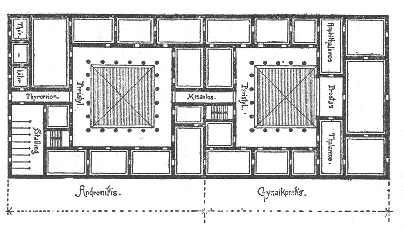
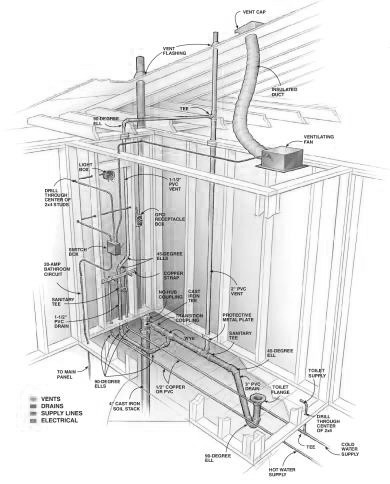
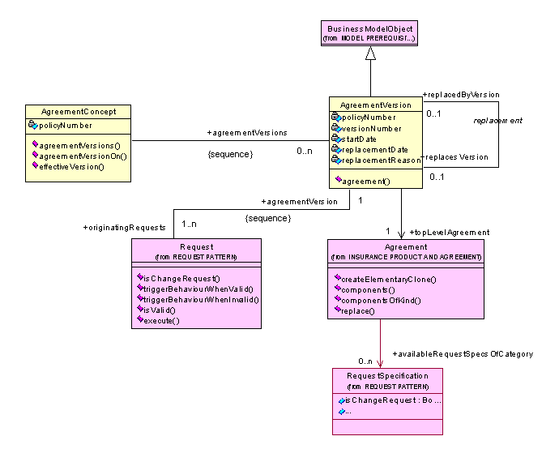
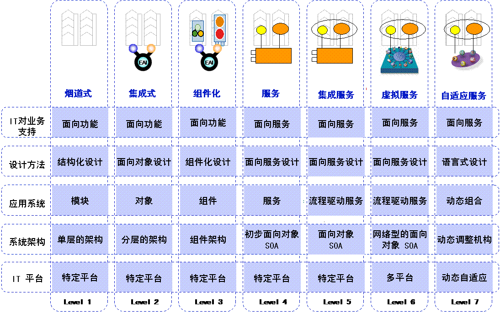

# 前言
企业管理是一门艺术又是一门科学。随着市场经济的发展和竞争的加剧，如何建立一个高效运转的企业是中国企业家和职业经理人面临的首要问题，也是目前企业管理中薄弱的一个环节。本书的目的是介绍一种在企业愿景和战略明晰的前提下，如何利用企业总体架构设计的方法，建立一个人、流程和技术相结合的企业运营蓝图。通过对企业现状的分析，以及未来目标的设计，发现存在的问题和机会，进行企业业务和运营模式的改进。本书介绍了一些实用的设计方法和工具，比如战略解析，业务模式和运营模式设计，流程设计，IT架构等。本书还会介绍企业管理领域最新的研究成果 ——业务组件模型（CBM）。CBM是目前分析运营模式和建立面向服务的企业（SOA）的主要工具。
世界经济正从传统的价值链向价值网络转变，企业通过与合作伙伴和客户的协作来创造价值。未来成功的企业渴望变革和勇于创新，需要重新思考传统的业务模式，打破传统的竞争模式。本书的内容是把高端的企业战略和操作层面的业务管理和运营结合起来，通过系统的方法来架构全新的企业的运转体系，建立业务和IT之间的桥梁。
在表现形式方面，作者信奉“A picture is worth a thousand words（一张图胜过一千个字）”的理念。书中尽量使用图表的方式来表达那些复杂的结构、关系、逻辑等内容，使读者更容易理解书中的内容。从下面的内容结构图，读者可以了解本书的章节以及它们的主要内容：

图表 11：本书内容结构图
本书中的每一个主题如果展开都可以用专门的书籍来介绍。由于篇幅的限制，本书的目的是在架构层面进行基本的、全面的介绍，并注重如何把这些主题衔接和关联起来，使读者掌握如何以企业战略为依据，设计业务组件模型和流程，再进一步设计数据模型和IT系统。
为了便于读者形象的理解企业架构的设计过程，本书会以一个假设的公司Rent-A-Car（汽车租赁）公司为例，介绍它是如何利用CBM、SOA等工具，建立了一个全面支持企业战略的业务架构和IT系统。在主要的章节中介绍完主体内容之后，都会给出实际的应用和设计的案例。
作者在2006年参与撰写过《企业总体架构》一书，主要是初步介绍了企业架构国际发展的情况，一些概念和基础知识，是一本企业架构的入门著作。从2008年初，本人就计划再写一部更加深入，兼顾业务和IT，并结合SOA最新发展理念的新书。但忙于参与很多企业咨询和辅导的工作，一直没有时间落笔。最终利用假期和休息时间，赶写出了本书。仓促之中难免会有错误或表达不当的地方，也希望读者、专家们提出，便于作者加以修正。
衷心感谢
于海澜
2008年秋于北京
邮箱：iamyu@hotmail.com
架构成功的企业
二十一世纪成功企业的特点
在IBM 2008年全球 1,000 位CEO的调查中发现，那些财务表现突出的企业，更加注重业务模式的创新。其中一位企业家表示：产品和服务可以被别人照搬，但是业务模型却能够带来差异化的优势。在标准普尔（S&P）500家公司中，能够从60年代存活到2007年的只有80家，大约占16%。那些存活到现在的企业的一个重要的共同点是他们根据市场、客户的变化而不断调整自己的运营模式。很难想象一个蒸汽机年代的公司使用相同的业务模式，能够在当今互联网时代生存。
几乎所有被调查的CEO都在调整企业的业务模式，超过40%的正在实施业务模式创新和转型。通过研究发现，未来成功企业的特点之一就是渴望变革和开展颠覆性的业务创新。成功的企业需要对传统的业务模式发起根本性的挑战，彻底打破传统的竞争方式；需要关注价值的创造，抓住机会彻底改变企业乃至整个行业。业务架构设计是完成以上变革的重要工具。通过引入创新的理念和模式，设计未来2-3年组织架构、端到端的流程，部门间的协作和IT系统，建立企业运营的蓝图，实现企业的战略发展目标。
虽然大家都知道变化是永存的，但是在21世纪变化对比以往会更加广泛、更加迅速、更加深刻。正如2008年的全球经济风暴，它的规模和影响程度是史无前例的。企业想要成功甚至生存，需要拥有以下五个方面的特征：
——勇于变革
很多企业已经赶不上越来越快的变革的节奏，企业需要多方位的建立鼓励变革的文化和机制，勇于迎接变革，勇于扶持不完善的想法，勇于承认失败。同时变革需要系统的方法，使变革的想法能够付诸实施。要关注变革的效果，而不是为了变革而变革。
——超越客户期望的创新
当今的客户更加有知识，有更高的要求。越来越多的客户通过网络了解和比较产品和服务。消费者会在社区、论坛中交流信息和经验，负面的评价会很快流传开来。这种状况对于企业来说，即是挑战又是机遇。对于领先的企业，可以充分利用客户的高要求和信息透明性拉开与竞争对手的距离，他们不仅仅是满足普遍性的需求，而是致力于超越客户的期望，创造全新的产品和服务体验。
——具有国际视野，整合全球资源
随着全球化进展，“世界变得越来越平”。未来企业的竞争不是在单一地域的竞争，而需要整合全球资源，走上国际舞台。华为通讯、联想电脑、中国铝业、中石化等大型企业都纷纷走出国门，并购海外企业，开拓海外业务，进入了跨国经营的时代。当然由于缺乏国际经验和管理手段，也遇到了不少挫折甚至失败的情况。但是风险和回报总是相辅相成的，在广阔的国际市场面前，中国企业不能退缩，而需要从提高自身决策和管理能力的角度解决问题。那些在资本、技术、管理等方面落后的企业，会在全球行的行业整合中逐步被淘汰。
——颠覆性的企业架构
产品和服务的同质化，使企业更加重视业务模式的重新设计，而不是在旧的模式上修修补补。随着新技术的出现以及世界更加一体化，以前的不可能已经变为现实，创造了无限的机会。企业架构的变革需要系统的方法，而不再仅凭经验和感觉。价值网络、业务组件化、外包等都成为创建全新的企业运营模式和架构的方法。缓慢的改进已经无法满足企业未来发展的需要，企业家需要从一张白纸开始考虑全新的企业架构，并参考其他新兴行业的经验，大胆的尝试新的业务模式。
——具有社会责任感
社会责任越来越被企业的客户、员工、合作伙伴、股东所重视，特别是在环境保护和社会福利方面，他们对企业的行为十分关注并充满了希望。客户的对社会责任的看法会体现在他们的购买行为当中。企业需要开始审视自己的社会形象，不仅是通过宣传而是采取具体的行动来建立良好的社会形象。对社会担负责任不只是付出，声誉优势可以建立差异化竞争力。比如推出环保型的产品不仅会降低对环境的破坏，而且能够吸引那些环保意识强的客户，提高销售并建立客户忠诚度。
成功变革的国际企业举例：
——作为世界500强，全球电力和自动化技术的提供商ABB公司从2002开始，启动了多个改革项目。通过出售非核心业务从而更加注重能源和自动化领域。2003年开始发现数百个提高效率和降低成本的改革机会，每年节约9亿美元。2005年ABB又进行了企业瘦身计划，减少企业管理层次，建立全球标准化的财务、人力资源、IT等服务流程。这些改革项目都有具体的业务和财务指标，企业高层定期对项目评估和考核，保证了变革的执行效果。ABB公司勇于变革和实施变革的能力，使她能够从容的迎接未来的任何挑战。虽然在全球经济衰退的情况下，2008年ABB仍然达到了创纪录的销售额340亿美元，净利润达到了31亿美元。
成功跨国经营的中国企业举例：
——华为公司在成立的20年后，已经迈入了跨国企业的行列。2008年销售超过230亿美元，海外收入占比达到75%以上。华为从很多中国企业都经历过的劳动密集型企业发展成为知识密集型企业。在中国、美国、印度、俄罗斯等地都设立了研发中心，构建了全球共享的研发体系和平台，每年的专利申请上千件，多项产品的市场份额达到了世界领先的水平。华为从99年就开始借助咨询公司的力量，开始产品开发、供应链、财务管理、人力资源等方的重整。新的管理机制和流程，提升了华为的管理能力，为以后的全球化扩张打下了坚实的基础。
中国经济的快速发展，使得企业不得不持续的变革，跟上市场的步伐。中国企业在原材料和人力方面的低成本优势逐步丧失，印度、东南亚、南美等成本更低的国家对中国形成了很大的威胁。中国企业需要从“中国制造”向“中国创造”转型，转变低价竞争的经营模式，调整企业产品和运营，否则会遇到生存危机。全球化既给中国企业带来了挑战，也带来了机遇，使得中国企业有机会获得稀缺的、又赖以生存的石油、矿产等资源，开辟新的市场和获得新的技术和产品，这些都是中国企业进一步发展的关键因素。面对机遇和挑战，中国企业要引入全新的管理思路，建立企业架构管理理念，从新设计企业的未来运营模式，创建核心的竞争力。
企业的创新模式
在2008年的全球CEO调查中，几乎所有的CEO都认为变革是必然的，但是应对变革是有挑战的。调查中三分之二的企业都在进行大规模的业务模式改革，去应对市场和客户的变化，把握竞争机会。对于中国企业而言，在过去的经济快速发展的阶段，市场充满了机会，只要进入了市场，就能够快速的发展，获取优厚的利润。但是2008年的经济危机、市场的成熟、竞争的加剧使很多一路顺风顺水的企业重新考虑自己的业务和管理模式，开始加紧提升自己的“内功”。成功的企业是“架构”出来的，而不是自发形成的。通过对多家世界级成功企业的发展历程的分析，可以发现他们无不经历了巨大的甚至是痛苦的转变过程。
最大的移动通讯公司诺基亚在18世纪中期成立的时候是芬兰的一家造纸企业，随着科技的发展，诺基亚逐步进入电缆、电子行业，甚至还生产过计算机。直到1968年，诺基亚才开始进入移动通讯的行业。诺基亚拥有很多个世界第一：第一个国际移动电话网络、第一次GSM通话、第一次卫星通话、第一部WAP手机、第一部3G手机等等。创新和领先一直是诺基亚的特点，最终造就了当今最大和最成功的的移动通讯公司。
成功的企业需要创新和变革，可以是开发新的产品和服务，开拓新的市场，或者是业务和运营模式的创新和变革。竞争对手可以复制产品和服务，但是业务模式可以使企业脱颖而出，与众不同。通过对全球成功企业的分析，业务模式的创新有以下行业模式创新、收入模式创新和企业模式创新三种方式：
1. 行业模式创新：通过创建或进入新行业、重新定义行业规则等方式实现行业价值链的创新。上面提到的诺基亚就是行业模式创新的典型案例。还有苹果Apple公司通过iPod和iTune的联合，提供了全新的音乐购买和欣赏方式，使苹果公司不仅获得电子产品的利润，还赚取了丰厚的音乐分销的利润。
2. 收入模式创新：通过对产品和服务的重新或者新的定价方式提供新的价值模式。例如，吉列公司开发业界领先的可替换剃须刀，凭借销售专用刀片获取高额、持续的收入。
3. 企业模式创新：通过改变企业、合作伙伴、客户的关系而实现价值链角色的创新方式。例如，在市场响应速度决定成败的服装零售行业，Zara实现店铺、设计和生产环节之间的快速反应机制。通过缩短从获得市场信息到设计、生产和上架的时间，使快速反应成为Zara的利润来源，成功开创了“快速时尚”的企业模式。
最成功的在线销售公司亚马逊则在多个方面进行了创新和变革。亚马逊公司从无到有开创了在线销售行业，采用了直销、代销、网上店面等多种收费方式，亚马逊的运营模式构架于全新互联网技术和与物流公司的紧密配合基础之上。亚马逊的成功正是由于在诸多方面的创新和与众不同，使之成为电子商务领域的领先者。
中国经济发展还有20-30年的高速发展期，庞大的内需还在不断的被发掘和释放。研究预测2020年中国将取代美国成为世界最大的制造国；2050年成为最大的经济体。在这个过程中，很多的中国企业会走出国门，发展成为世界级的企业。像联想并购IBM个人计算机业务的案例会层出不穷。中国企业需要从战略、商业模式、运营模式等方面的创新和变革来促成企业的转型和不断的成长。但是变革的方法是什么？如何改造企业？如何发现变革的关键点？
企业的变革需要一种系统的方法，或者说成功的企业是“架构”出来的，而不是自由发展而成的。企业的架构包括了业务组件、流程、组织、绩效、IT等多个方面，它们都需要随着企业的变革而不断的演化和发展。变革的目的不仅是规模和收入的扩大，而更是利润的增长，否则企业无法持续的发展。市场开放、经济全球化和互联网的普及都成为了新的企业成长的动力，而且也会激化市场竞争，促使企业渴求变化和建立新的运营模式。
未来企业业务功能的组件化
传统企业生存和发展的方式是创造价值并与消费者交换。这种以企业个体创造价值的观念正在被行业合作伙伴共同创造价值的观念所替代。管理战略大师普拉哈拉德就提出 ——共创价值是未来变革的策动力。在他的多部著作中都提出：“很多企业还没有利用全球化带来的机遇，还没意识到不仅是游戏规则在改变，游戏中的角色也发生了变化。”他认为没有一家企业的经营范围和规模大到可以随时随地满足消费者的要求。企业将会利用众多其它企业的资源，而不是自己拥有全部资源。由此，以企业和产品为中心的传统价值观，正在被一种专业化和共创的价值观所快速替代。
当今企业的发展正从传统的价值链向价值网络转变；从以部门划分职能到功能组件化和外包的转变。传统的价值链是流水线式的生产方式，每个生产环节会增加产品的价值。而现在复杂多样和快速变化的市场要求企业与合作伙伴、客户实时的互动。价值网络使企业可以更加灵活的、动态的生产和提供服务，通过与合作伙伴和客户的协作来创造价值。
企业建立价值网络的前提是完成组件化，就是把企业的产品、销售、采购、生产、财务等业务功能转变为业务模块，即业务组件。各个行业都在向组件化发展，虽然有快有慢，但是这是发展的大趋势。如果发展到极致，整个行业都组件化了，行业中所有的企业只从事价值网络中的一部分专业化的工作，那么这个行业就只会产出一种产品。比如在汽车、电子、计算机等行业，组件化和专业分工十分明显。各个厂商的产品趋同，商品化很普遍。在这种趋势下，企业需要快速改造自己，形成组件化的企业架构，在未来价值网络中占据核心和最有价值的位置，掌握主动和先机。
对比一下1983年和2003年的计算机行业，就可以发现很大的变化。越来越少的计算机厂商从事端到端的生产。更细化和专业化的分工使得整个行业发展的更快，提供性能价格比更高的产品。从分销、PC制造、软件、芯片生产等都由专业化的公司提供服务。每个参与者都在计算机的价值网络中提供自己的价值。比如伟创力公司（Flextronics），专门从事计算机的技术研发和贴牌制造，很多我们熟悉的产品都是伟创力制造的，反映计算机行业已经进入组件化、专业化的产业链时代。

图表 21：计算机行业专业化、组件化演变对比
从上个世纪开始至今，全球的企业都在不断寻求变革和优化的方法。最初的业务线条优化只考虑部门内部的或产品线内部的优化。虽然做到了局部的优化，但是由于缺乏各部门之间的沟通和企业层面的协调，造成了很多职能重叠和浪费，流程之间的共享和交互能力低。
1990年代开始的业务流程再造（BPR）的方法，起到了部分企业流程优化的目的，通过建立共享流程实现了标准化和集中处理。但是问题在于虽然单个流程做到最优，但是企业整体没能得到优化，变得越来越复杂，可能还增加了整体的成本。
而当今提出的业务组件化的方法，则可以通过内部组件化和外部专业化的转变，提高企业到灵活性，并实现跨越式的增长。组件化可以消除企业内部的冗余的功能，明确战略重点的组件，非关键组件可以通过外部获取，从而实现从价值链向价值网络的转变。

图表 22：企业优化的发展阶段
企业需要灵活，需要随需而变；但是企业的成长和发展也需要一定的稳定性，否则就会发生混乱。如何平衡它们之间的矛盾是一个很关键的问题。通过建立组件化的运营平台，可以用稳定的、有限的组件，搭建多样化的企业。好比乐高积木玩具，使用几个简单的塑料积木，就可以搭建出来变化无穷的造型。

图表 23：简单的积木搭建出来多样的造型
成功实现组件化的企业案例：利丰公司（Li & Fung）
——利丰公司在服装制造的15个环节中，只负责设计、采购、质检等10个环节，而有意的不负责其中最复杂和投资最大的生产设备和工人管理环节。利丰虽然没有进行生产设施的投资，却通过合作网络使20多个国家的7,500家供应商和100万以上的工人为利丰工作。利丰把自己定位成为价值网络的管理者，这个网络可以向全世界的任何一个地方提供玩具、服装、配件、箱包等商品。利丰已经把采购、生产、销售、供应链完全组件化，并且在世界范围内选择了外部组件的提供者。组件化不仅使利丰避免了固定资产和资本的限制，从而可以快速发展。并且通过大量外部组件的可选择性，大大提升了公司的灵活性和市场反应能力。组件化使利丰从19世纪初香港的一家小小的贸易商行，发展成为营业额上百亿美元的跨国公司。
造就企业的架构
架构未来的企业
企业是否能够成功甚至是生存，它的应变能力、转型能力起了重要的作用。意味着企业需要做出企业架构的调整，甚至抛弃旧的运营方式，重组企业的组织架构、运营流程、考核机制和基础设施；还可能是转换核心能力，从而转向新的行业和领域。
美国管理大师诺埃尔（Noel Tichy）最早提出了企业DNA的概念。他把企业比喻为一种活的非自然生物体，与生物一样有自己的遗传基因。正是这个基因，决定了企业的基本稳定形态和发展、乃至变异的种种特征。 根据企业DNA的不同特征，企业可以分成以下7个类型：
——前瞻适应型企业：具有前瞻性眼光的企业，经常能对将要发生的变化进行预测，并未雨绸缪地做好准备。非常灵活，能迅速根据外部市场变化进行调整，却始终坚持清晰的经营战略，并围绕它开展业务。
——随机应变型企业：虽然不能始终做到未雨绸缪，但仍然能在必要时显示出“随机应变”的能力，企业发展尚可，但是容易失去机会。
——军队型企业：通常由少数有经验的高层管理团队领航，主要通过企业领导层的意志和远见卓识取得成功。它能够很好的执行公司战略，但是风险集中在领导战略层面。
——消极进取型企业：决策一致，但无法得到实施的企业。惰性很大，基层往往忽视上层的指令。管理层需要花费很大精力来推动企业前进。
——间歇型企业：企业有许多优秀领导，但是各自为政，缺乏控制和协调机制。当他们目标一致的时候，会取得巨大的成功，但是却经常处于失控的状态。
——过度膨胀型企业：该企业的扩张超出了运营模式的负荷，膨胀过度而运转不灵。管理层已经无法再有效地控制企业。
——过度管理型企业：多层管理，官僚作风，效率低下，落后于市场和竞争对手。
全球1/3的企业属于前3类，是健康型企业；而后4种被视为不健康。 可以看出前瞻适应型企业将是未来市场的主导者。很多企业都希望能够转变成这种成功的企业。企业的架构就好比是企业的DNA，它决定了企业发展的方向和结果。好在企业架构的组成和转变有成熟的方法论，本书会介绍如何运用这些理论和工具去架构成功的企业。
企业架构（EA）理论介绍
企业架构是一个对企业多角度、综合的描述，反映了企业的人、流程、技术的组织和安排。对于企业的不同的参与者，提供了不同的视图，用他们易于理解的方式和语言反映企业的状态。企业架构在国内的使用还在比较初级的阶段，没有很明确的定义，以下是不同的专家的相近但是又不相同的定义：
——“企业架构是定义企业各组成部分如何构建以及它们之间的关系，和它们的设计和演变的原则、规定。”
——“企业架构是企业的逻辑蓝图，定义了企业的结构和如何运转，使企业能够达到现有和未来的目标。”
——“企业架构是根据企业运营模式的需求而建立的系统化和标准化的业务流程和IT平台设计的方法。”
以往企业管理者提到企业架构时，经常会理解成为企业的组织架构，或者是流程图。IT人员会把企业架构理解成为IT架构。但是从企业架构的发展趋势看，现在的企业架构已经涵括了业务、组织、技术等多个层面，并且使这些层面协调统一、相互贯通。目前国内企业架构的使用还主要是在IT层面，业务人员还没有开始利用这个工具进行业务运营模式的设计和规划。其实企业架构是一个涵盖业务、IT的全面企业蓝图设计工具，可以帮助企业的管理者了解企业的构成，发现问题并不断的改进。
很多企业随着业务的发展，建立了很多分割的部门、流程和系统，它们之间无法协调的合作。经常出现部门之间的职责界定不清稀，配合不顺畅；运营的效率较低，很难贯彻公司战略意图；业务和IT部门的沟通不畅，系统功能滞后等等问题。更可怕的是企业没有方法和工具来解决这些问题。根据国际和国内的经验，企业架构的方法是能够有效的解决这样的问题。
架构是一个很早就出现并且被广泛应用的一个概念。早在古希腊时代，维楚维斯.波利奥（Marcus Vitruvius Pollio）所著的<<建筑十书>> 中，就论述了对于建筑架构设计的理论，成为有史以来最早的关于建筑架构的著作，维楚维斯也被誉为最早的架构师。

图表 24：维楚维斯绘制的古希腊建筑架构图
架构设计经过漫长的演变到现在，已经成为现实生活中必不可少的活动。比如要建一栋房子，就需要进行很多的架构设计工作。首先要进行外部架构的效果设计，在客户满意之后，才进一步设计内部结构，以及相配套的包括线路、上下水管道等多方面的设计，就好比企业架构设计的时候，从不同的层次和角度去描述一个企业的特征。

图表 25：建筑管线架构图
虽然很多企业在建设和施工的时候，没有架构图就进行是不可思议的事情；但是在企业管理方面，却完全是另外一种情况。很多公司虽然运转了很长的时间，但是一直没有明确的企业架构和蓝图，或者只有很不系统的流程图和组织架构图，从而导致前面提到的很多运营中的问题。如果这些问题也发生在你的企业里面，不要头痛医头、脚痛医脚，局部的流程改进和系统改造不会起到很好的效果。只有通过企业架构的方法，规划和设计好业务和IT架构，再进行有目标的、持续的改善。
虽然关于企业架构的理论已经有不少，但是在与企业实际情况结合，特别是是与中国企业的情况结合的理论却很少。许多企业架构或是过于理论化，难以与实际应用，或是没有实际实施的案例，难于理解。本书的目的是集众多理论的长处，以及国内外众多企业架构实施经验和案例，建立一个即实用又易于理解的架构。由于它涵括了企业业务和技术全方位的内容，所以也可以称之为“企业总体架构框架”。下图是企业总体架构的框架图，具体的每一个部分的内容会在后续的章节中介绍。

图表 26：企业总体架构框架的组成部分
企业总体架构框架（简称企业框架）由两大部分组成：业务架构（EBA）和IT架构（EITA）组成，包括了从业务组件、流程、组织、分布、绩效、IT等企业各个方面的内容，可以全面的对企业进行设计和规划。
企业架构必须能够为企业带来价值才有推广的意义。企业架构能够帮助企业解决的问题有：
- 帮助企业建立一个全新的业务运营模式，落实企业的既定战略
- 改进企业的业务流程，使得业务运转得更加高效、降低成本、提高客户满意度
- 帮助企业分析产生问题的根源并设计改造方案
- 帮助企业高层领导、董事会、股东清晰的理解企业运营的计划、价值和挑战
- 帮助各个业务线条的沟通和配合，减少和消除职责重叠或者盲区
- 提高与实现最佳的IT投资回报，规避、减少、以至消除由IT项目和IT系统的风险
如果没有企业架构，就无法从企业层面全面的考虑问题。在企业中单纯的流程改进比较局限，流程优化无法在企业内部达到最优和共享；经常会出现不同业务部门间的割裂，职能重叠效率低下；客户信息和服务不能共享，成本居高不下。在没有企业架构的情况下进行IT设计，容易使IT系统与业务脱节，IT系统会依赖于设计者的行业经验和业务知识，而没有体现业务驱动IT的原则。
曾经有人统计“98%的矛盾是由于误会产生的”。企业的业务越来越复杂，有很多的部门和众多的岗位。虽然很多企业有业务文档，但是很难找到有用的信息，而且还由于没有更新而与现实相差很远，根本无法体现企业当前的状态。我们经常会看到在建筑工地，工作人员展开一张张蓝色的图纸，研究问题。为什么不是一堆堆文件？因为图纸更加直观。对于传递同样的信息量，图能够比文字更加有效。企业架构图也能够起到相似的作用，使参与讨论的人员对企业的构成一目了然。同时图也很适合企业管理者跳跃的思维方式。文字更适合研究连贯性的主题，比如理论推导性的论文。企业架构是一个系统的、有层次的、图形化的设计工具，可以帮助企业改进业务和运营模式，提高各个部门和流程之间的协调程度，提升对企业战略的支持程度。
企业战略通过架构而实现
企业战略是指企业为谋求生存和发展而做出的长远性、全局性、关键性的决策和方案，帮助企业回答那些关键的、方向性的问题。比如“我是谁？”、“我从哪里来？”、“我将到哪里去？”、“我将如何去？”等问题。做一个通俗的比喻，优秀的运动员需要强健的肌肉、灵活的韧带、高超的技巧，而且他们都会选择一个专业，成为田径、球类、或者体操运动员，从而集中精力发展这方面的能力。企业的战略的也是这样，需要选择自己的发展方向。企业的经营管理都必须遵循企业战略的方向。任何偏离企业战略的做法，就是动机和方法再好，也是错误的。
企业架构是帮助企业高层管理者实现战略的重要工具。中国的企业家虽然常常能够制定正确的战略，但是在战略执行的时候，经常会遇到很多困难和问题。对于他们来讲，如何把战略通过业务模式贯彻到企业的日常运作中，成为最为关键的议题。
企业架构的源泉是企业的战略。企业架构主要包括企业业务架构（也称为运营模式）和IT架构。企业架构与企业战略和企业运营环境密切相关。企业战略决定了企业架构的形态，而企业实际的运营环境是在企业架构指导下建立的企业日常的运作。可见企业架构是战略与实际运营之间的桥梁，帮助战略的落地。下面的企业战略、架构、日常运作的关系图，清晰的展示了战略的指导作用和企业架构的桥梁作用。

图表 27：企业架构与战略和运营的关系图
如果把企业比作一个城市，战略就好比城市的定位和发展目标。为了达到城市的目标，需要规划部门设计城市的发展方向、规模和布局，计划建设项目，保证城市协调合理的建设和发展。 规划确定后，就进入了具体建筑的设计和实施阶段，但是必须符合城市整体规划。企业架构好比是城市规划，为了支持战略的实现，设计业务和IT架构和它们的实施路线图，指导企业日常的运作。在建立具体的业务能力和开发IT系统的时候，必须遵循企业架构的原则和蓝图，从而保证战略的实现。
但是高效的企业架构和正确的企业战略关注点不相同。首先它们的目标不同：虽然它们都可以改善公司的表现，但是却是从不同的角度出发的。企业架构的改进关注于把同一件事比竞争对手作的更好、更便宜；而战略关注的是与竞争对手作不同的事或者采取不同的方式做事。其次它们的改进手段不同：业务架构的改进通常采取流程改造和优化，应用先进的技术，加强管理等方法获得效率和成本改进的；而战略改进是建立与竞争对手不同的定位和业务活动。
但是随着行业生产力不断的提升，新技术的扩散，业务架构改革的余地会越来越小；而战略的制定需要创造力和远见，发现企业独特的市场定位。但是战略如果没有业务架构的落实，也会成为空中楼阁。总之战略决定作正确的事，而业务架构决定了正确的去做事。它们是相互依赖的两个领域的问题。
2008和2009年企业将会面临严峻经济环境的挑战。虽然这次全球性经济危机的程度还不能确定，但是能够确定的是企业必须开始转变自己的经验模式，延续旧的运营模式不会取得成功。企业家们必须现在就开始行动，而不是等到问题出现再被动的应对。在通过对2008年底股票表现最好的美国、欧洲和亚洲公司的调查发现，它们共同的特点是注重价值创造，发现新的机会并能够快速行动。它们可以用最少的资源产出最大的价值，优化成本而不是简单的缩减开支，建立差异化优势并且提高灵活性和市场响应能力，并且清晰规划了未来企业发展的模式和方向。
很多企业可能无法渡过本次的经济危机，但是那些企业架构和运营领先的企业却把本次危机当作难得的发展机会。经济危机中的企业首先要做到站稳脚跟，稳健经营。但是为了长远的发展，还需要发现新的机会，改造自己甚至改造整个行业。本书介绍的企业架构理论可以帮助企业管理者们完成这一艰难但是很有意义的转型。
本书主要的案例：Rent-A-Car 汽车租赁公司由于企业架构的概念以及相关的很多方法和理论在国内还是很新的概念，为了便于读者理解，本书使用了一个虚拟的企业Rent-A-Car汽车租赁公司来解释和举例说明这些概念。这个案例与实际的企业架构项目的发展十分相似，会随着章节的不断深入，从发现问题逐步发展到分析和解决问题，最终建立企业的业务架构，IT架构，实施路线图。本书的读者会来自各行各业，无法用一个案例说明各个行业的问题；但是解决问题的办法和工具是通用的。如果能够深刻和准确的理解了Rent-A-Car案例，就能够把这一整套的方法利用到自己的实际工作和项目当中去。在本书的附录中，会有一些行业的资料和模板供大家参考。如果还有其它的问题也欢迎与本书作者沟通和交流。本书主要的案例：Rent-A-Car 汽车租赁公司由于企业架构的概念以及相关的很多方法和理论在国内还是很新的概念，为了便于读者理解，本书使用了一个虚拟的企业Rent-A-Car汽车租赁公司来解释和举例说明这些概念。这个案例与实际的企业架构项目的发展十分相似，会随着章节的不断深入，从发现问题逐步发展到分析和解决问题，最终建立企业的业务架构，IT架构，实施路线图。本书的读者会来自各行各业，无法用一个案例说明各个行业的问题；但是解决问题的办法和工具是通用的。如果能够深刻和准确的理解了Rent-A-Car案例，就能够把这一整套的方法利用到自己的实际工作和项目当中去。在本书的附录中，会有一些行业的资料和模板供大家参考。如果还有其它的问题也欢迎与本书作者沟通和交流。
案例分析：Rent-A-Car公司企业架构项目的背景
Rent-A-Car是一个全国性的、有着数十年历史的汽车租赁公司。拥有100多家分支机构和营业部，员工2,000多人。但是由于发展过快和市场的激烈竞争，企业管理混乱、一直处于亏损的状态。董事会为了扭转局面，聘请了新的CEO。到了今天，新CEO已经到位一个月多了，和财务、运营、销售、IT、人力等部门的负责人召开了很多会议，试图了解公司的情况。虽然这些负责人都经验丰富，精通业务，但是令他失望的是从各个部门得到的信息或者资料难于理解。它们不仅描述方式不同，术语和口径各异，而且传达的信息不一致。好像一幅残缺的拼图，怎么也无法拼成企业的全图。目前CEO最想要的是一个描述企业全部业务的模型，发现现在企业运营中的问题，设计出全新的指导未来3-5年企业发展的目标和改进计划。CEO想起了他的老朋友亨利，一个在行业工作了多年的咨询专家，来帮助他理顺企业的架构。
CEO说：“亨利，我虽然上任一个多月了，但好像还是处于雾霭中，看不到企业的真实模样，更无法把我的战略思想落实到企业的运营当中。你是否能够帮助我解决这个问题呢？”
亨利：“我们以前做过很多类似的咨询，通过使用企业架构的方法，帮助企业了解自己企业的构成，并且设计未来的发展方向。”
CEO回答：“企业架构是什么概念？是否全面直观呢？我不想去研究一个深奥的概念或者报告。”
亨利摇了摇手，笑着说：“我最了解你们CEO，没有时间研究高深的理论。企业架构就好比一张企业的全身照，再加上几张不同部位的X光片，再容易理解不过了。”
CEO满意的说：“那项目周期和工作任务如何安排呢？”
亨利在纸上一边画，一边讲到：“项目的时间长短和工作量和设计成果的多少相关，从3个月到半年不等。根据你们公司的情况，可以按照这个计划进行。”

图表 28：Rent-A-Car 企业架构项目计划
CEO看过了以后，兴奋的站起来说：“就这么定了，我给你20周的时间和5个全职人员，所有部门支持你的工作，马上就开始企业架构项目。”
架构成功企业的第一步——业务架构
什么是企业业务架构（Enterprise Business Architecture）
企业业务架构（EBA）又称为企业运营模式，是企业战略转化为实际日常运营的必经之路。业务架构好比是一个基础平台，是企业相对稳定的核心；企业在业务架构上建立的流程和业务功能能够满足市场、客户不断变化的需求，做到差异化竞争。
业务架构定义了企业如何创造价值，企业内外部的协作关系，描述了企业如何满足客户需求，进行市场竞争，与合作伙伴合作，建立运营体系，考核绩效等。业务架构是战略决定企业各组成部分如何运转的工具，建立了企业战略与日常运营之间的关联关系。宏观层面的企业战略，需要通过业务架构进行分解，使战略范畴落实到战术范畴。通过运营对战略的支持，才能够达到企业预先设定的业务目标。
假设企业的战略目标是降低运营成本20%，实现该战略目标则要对现有的运营模式进行改造。比如可以采用提供网络自助服务，裁减客户服务人员40%；或者改造现有业务处理流程，裁剪20%附加价值低的环节等方案。日常运作的组织、流程、IT系统都应该是在业务架构指导下运转的。如果没有业务架构而直接组织和建立企业的日常运营，就会出现运营与战略脱节、各个业务环节缺乏统一协调等问题。其实所有企业都存在着业务架构，有的是有意识设计的架构，还有很多是无意识的在运用着特定的业务架构。当然精心设计的架构会提高企业的效率和竞争能力，避免企业中很多管理方面的问题。
企业业务架构的内容
定义和范畴
广义的业务架构定义包括了产品、销售、客户服务、财务、人力资源等企业全部的业务功能和职责。业务架构是把企业的战略转变成为企业日常运营的目标和形式，明确人员、资金、IT、服务等企业资源如何进行部署和分配。一个企业不可能在所有的方面都做得最好。制定企业战略除了选择要做什么，同时也要选择不做什么。很多成功的企业就是根据自身特点，选择了一个发展方向并作到行业领先。战略会决定业务架构的模式，所以业务模式设计时需要明确以下的战略决策：
- 需要开展什么业务？
- 产品/服务的市场定位，比如是提供最高端还是最低价，或者是最可靠的产品/服务？
- 企业如何竞争，是低成本还是高质量，还是创新？
- 企业战略目标对运营平台能力的要求，具备什么样的生产能力、硬件设施、技术、合作伙伴等？
- 企业战略对运营平台灵活性的要求，比如是否提供客户化的产品，市场反应速度需要多快？
国内很多公司还没有建立运营模式或者业务架构的体系和方法，盲目的采纳了所谓的行业最佳实践，但是却不适合企业自身的特点。有些企业虽然通过流程改造等方法做了局部的优化，但是没有开展支持企业战略的全面的业务架构优化和创新。很多企业试图在各个方面都做到最好，但却分散了精力，没有自身的特点，行业同质化严重。业务战略其实不只是决定什么要做得最好，也要决定什么不必要作的最好。
在中国现阶段下，很多企业家有很好的战略远景，但是却找不到能够实现远大战略的方法。业务架构其实就是实现企业战略的手段。企业的业务架构包括了以下7个方面的内容：

图表 31：企业业务架构的7个组成部分
虽然业务架构涉及了企业运营过程的方方面面，但是架构设计毕竟是在高层次的工作，是提供方向性的指导，而不是具体设计详细的操作手册或者业务规则，那些工作需要由各个部门在业务架构的指导下分头去完成，但不属于业务架构研究的范畴。
业务架构的对日常运营的指导
当企业设计完整的业务架构后，就能够从以下这些方面来指导企业的日常的业务运营：
——产能：需要提供多少产能？比计划的产能高、低，或者合适。如何提供需要的产能？产能采用大批量还是小批量来实现，是否使用加班还是轮班，是否需要扩大产能和设施？
设施：集中的大型的设施还是分散的小型的设施。设施的分布的依据？产品、流程环节还是地域？接近客户设置还是接近原材料产地和劳力？
——技术：人力密集型还是自动化，实施采购软件还是自己开发，在技术应用上是跟随者还是领导者，在哪些方面领先？
——内外包：自己制造还是外购？考虑成本、技能培养和积累、依赖型。与合作伙伴现在或者未来是否有业务重叠？是否想要控制合作伙伴？成为紧密合作伙伴还是一般商业关系？
——人力：员工选择条件和技能要求，如何进行培训，培训什么内容？如何聘用和保留人员？
——生产安排和控制：库存的种类是原材料、半成品、成品？派发任务还是主动申请任务？
——质量体系：如何保证质量？采用什么质量保障体系？如何使员工支持和参与。采用集中的“质量管理部门”，还是采用分布式的、全员质量文化的方式；
——组织方面：如何进行组织管控，如何安排员工岗位和汇报线，报酬和待遇、利润分享计划、奖金、计件薪酬、特别班次补贴等的安排。
组织保障
在理解业务架构的重要性之后，企业的管理者需要作的是建立一个常设的运营部门来负责这项重要的任务。在公司的业务决策的过程中，要使用业务架构来讨论、理解和解决问题。一般在最初的建立阶段，咨询公司或者外部专家可以帮助企业建立整个体系。在后续的企业运转中，需要具有丰富经验、业务能力强、掌握正确方法的人员来负责企业运营的创新和不断改进。业务架构团队应由以下的人员组成：

 | 人员 | 职责 | 
| --- | --- |
 | 负责人 | 一般由主管公司运营的领导负责，提供所需的资源，协调各部门之间的关系，确认设计的成果，推动项目的开展。 | 
 | 首席业务架构师 | 对公司的整体业务架构的设计和维护负责，确定工作方法，领导设计团队，解决工作中的实际问题。 | 
 | 业务分析员 | 运用公司规定的方法，进行具体的业务领域的分析和设计。根据能力的不同，可以分为流程、组织、IT等不同的领域。 | 
 | 专家 | 可以是公司内部或者外部的专家，提供行业和运营的专业知识，提出建议性的意见，审核和评估设计方案。 | 

业务架构7个组成部分的设计方法
企业的业务架构包括了业务组件、流程、组件分布、内外包模型、组织架构、绩效考核、架构管理7个方面的内容。其中业务组件是进行其它要素和模型设计的基础，是公司业务架构设计的首要工作。本书介绍的方法是基于组件化的业务架构设计方法，注重于使用业务组件进行流程、分布模式、组织等的系统化的设计，使他们能够相互协调和配合。业务组件就好比是企业建设的部件，会在流程设计、组件分布、组织架构设计当中使用。在实际的流程、组织等项目中，还有很多其它的设计方法。这些方法可以与本书介绍的方法结合使用或者相互替换，需要根据企业和项目的情况来决定。
业务组件模型 – CBM
CBM是 Component Based Modeling 的缩写，直译就是“业务组件建模”。组件化就是把企业的产品、销售、采购、生产、财务等业务功能转变为业务模块，即业务组件。CBM是通过企业功能组件化的方式对企业重新定义和组合的过程，在一张图上就可以直观的显示出企业的业务蓝图。但CBM不仅仅是企业高层次的描述，而是一个内容丰富的业务模型设计工具。它采用了一个全新的视角 – 组件化的方式对企业进行分析和设计。
业务组件模型
组件化的业务模型是一张业务架构图，使企业管理层能够同一层面上进行业务决策。每个业务组件有自己的边界，提供特定的业务服务，也使用其它业务组件的服务。组件拥有自己的资源、人力、技术和能力去为企业创造价值。下图是以Rent-A-Car公司为例的CBM总图。CBM图可以有多层。最高层面的是总图，总图一般又可以分解为2层和3层CBM活动图。

图表 32：Rent-A-Car公司CBM业务组件总图
CBM总图中纵向是职能层次（Accountability Level），分为战略规划（Direct）、管理控制（Control）、执行操作（Execute）三个层次。不同的层次代表企业不同层次的职能：
——战略规划是属于公司高层管理者负责的范畴，主要明确战略发展方向，建立总体的方针政策，调配资源，管理和指导各个业务板块；
——管理控制是中层经理进行的管理活动，主要是企业部门经理和分支机构主管。他们负责把战略落实到日常的运营当中，监控和管理业务指标和企业员工；
——执行操作是进行具体操作的员工，从事本组件负责的业务功能，处理业务请求和业务数据，注重作业效率和处理能力。典型的岗位有销售代表、操作人员、工程师等。
CBM总图中横向是企业的业务能力（Business Competencies），即企业创造价值的能力。管理、设计、采购、制造、销售等是一般企业都需要的能力。业务能力的划分能够帮助企业明确不同业务单元的功能，划分它们的边界，制定它们的关联关系。可以确保所有的工作有人在做，而且没有人在做重复的工作。这对于业务架构的设计是很重要的。虽然这只是一些最基本的原则，但是在很多国内的企业中却无法实现。
由于不同行业的企业业务能力和活动有很大差别，所以每个行业都有自己CBM图。以下列举了银行业的CBM总图。

图表 33：银行行业业务组件CBM总图
从业务组件的特点可以看出与SOA的特征完全相符。所以业务组件化正是SOA进程的开始。彻底的SOA并不仅仅是IT的改造，而是从业务架构改造入手，会得到更加显著的成效。从业务组件的特点可以看出与SOA的特征完全相符。所以业务组件化正是SOA进程的开始。彻底的SOA并不仅仅是IT的改造，而是从业务架构改造入手，会得到更加显著的成效。上图是根据上百家银行的情况总结出来的，具有广泛的代表性。CBM图的设计过程是首先定义企业级的业务能力泳道图，再细分每个泳道里的详细的能力，把详细的能力按照战略、管理、操作划分层次，最后定义组件的范围和属性。IBM全球咨询公司已经事先设计好各个行业的CBM模版，企业在设计的时候，不用从头开始。只需要以本行业CBM模版为基础进行客户化，来适应企业自身的特点。在根据我们的经验，对于国内的企业而言客户化的内容也不超过20%。
什么是业务组件（Business Component）
业务组件可以比喻称为建立企业的积木或者部件。一般的企业根据业务的复杂程度，会有100至200个业务组件，涵盖了企业所有的业务活动。组件内部的活动在企业范围内要做到全面且不重复（Mutually Exclusive and Collectively Exhaustive）。企业所有的业务活动必须而且只能归属于某一个组件。如果其它组件也需要相似的服务，只能通过标准的调用方式来使用，而不能重新再定义一次这个活动。这种调用就成为了一个服务，这就是SOA理念在业务层面的体现。
每个业务组件都有自己的业务目标、一系列紧密关联的业务活动、人力、技术、财务等资源、管理的方法以及能够向外提供的服务。业务组件能够独立的进行运作，即可以由企业内部完成也可以外包。下图详细说明了组件的各个组成部分。

图表 34：业务组件内部的组成部分
CBM业务组件的定义模版可以在CBM总图的基础上，详细描述组件的价值、活动、资源、考核、IT支持等信息。由于业务组件是企业架构设计中基础性的工作，清晰的的定义会给后续的流程、组织、分布模式、IT系统等的设计工作打下坚实的基础。

 | 业务价值 | 主要考核KPI指标 | 
| --- | --- |
 | 在企业中创作的价值… | KPI 1KPI 2 … | 
 | 2-3级活动 | 资源和成本预测 | 内外包 | 
 | 2级活动3级活动… | 1-3年资源计划…1-3年成本预测… | 内外包的原则…是否内外包 | 
 | 服务 | IT应用 | IT 基础设施 | 
 | 组件提供的服务组件需要的服务 | 应用系统1应用系统2... | 服务器、网络、数据库... | 

图表 35：CBM业务组件定义模版
业务组件的特点：
——业务组件是独立的业务模块，在企业系统中承担特定的职责。组件可以是企业自己完成或者由合作伙伴完成。企业组件化的过程也是内部和外部专业化的过程，企业可以通过组件化建立价值网络，重复利用外部资源来提升自己的竞争力；
——组件内部各个活动之间是紧密关联的，而与外部其它组件的关联程度较低。所以组件是可以独立运作的，使得专业化分工和外包成为可能；
——每个业务组件的输入和输出都高度标准化。组件不能够直接使用其它组件内部的活动或者资源，只能根据组件之间的标准接口提出服务请求而获得所需的服务；
——组件一般都拥有自己的资源，完成特定的活动提供价值的时候也会消耗资源。也存在没有资源的组件，它们只能通过调用其它组件的方法来完成自己的功能。
在前面提到过企业的战略要注重特定的领域，发展目标是在某些方面做得最好，而不是什么都想做得最好。在运营层面，企业需要明确支持战略重点的业务组件，集中精力和资源把它们做到最具竞争力。在对国际领先企业的调查中发现那些成功的企业只关注少数几个“专业”化的组件，并且在行业作得最好，从而得到了比一般企业更高的回报。下面的章节会介绍发现那些战略性的业务组件（也称为“热点组件”）的方法。
业务组件中活动的定义
组件的功能是由它的活动体现的，所以活动是组件最主要的组成部分。在图表3-3和3-4中的业务组件是企业级组件，或称为一级组件。一级组件是由多个二级活动组成；二级活动又可以分解为更详细的三级活动。如果把企业比喻成一辆汽车，一级组件就是发动机、轮胎、制动等部件；二级活动就好比组成发动机的曲轴、供油、点火等部分；而三级活动则是更细小的零部件。组件的三级活动，就会与流程设计中的活动相吻合。所谓流程就是为了完成一个特定的业务目标而把多个活动组合起来而形成的。活动就是设计流程时的零件，把这些零件组装起来就能够形成各式各样的流程。

图表 36：CBM的业务活动与流程的活动的关系
在CBM定义中，工作量最大的是定义组件内部的业务活动。下表是以Rent-A-Car CBM总图中的客户服务组件为例，进行二、三级活动的分解。

 | 业务组件 | 二级活动 | 三级活动 | 三级活动解释 | 
| --- | --- | --- | --- |
 | 客户服务 | 组件定义：管理公司与客户和合作方的客服活动 | 发起客服活动 | 公司发起客服活动 | 公司主动联系客户或合作方，包括准备清单、活动内容、发起等 | 
 |   |   |   | 跟踪潜在客户 | 通过对潜在客户的跟踪发现/促进销售机会 | 
 |   |   | 接受服务请求 | 接受和回复客户服务 | 接受客户来自各渠道的活动请求，了解客户的需要 | 
 |   |   |   | 分配客户的服务请求 | 根据规则将活动分类，分配到合适的资源，并触发相应后续活动 | 
 |   |   |   | 记录客户服务活动信息 | 记录活动（客户）的关联方，期间，状态，结果等信息 | 
 |   |   | 管理客户满意度 | 调查客户满意度 | 制定客户满意度调查清单和分析结果 | 
 |   |   |   | 跟踪投诉 | 跟踪投诉事件（日期，处理人，结果等） | 

图表 37：Rent-A-Car客户服务组件二、三级活动分解
一般企业有100个左右的一级业务组件，当分解到二、三级活动的时候工作量会变得很大。假设每个组件有3-5个二级活动，10-15个三级活动，那么就会有300-500个二级活动和1,000-1,500个三级活动，加在一起二、三级活动会有2,000个左右。虽然工作量很大，但是对于理清企业的运营情况是十分必要的。在流程、组织、IT系统等的设计过程中，主要使用的就是二、三级活动。
业务组件模型CBM的应用
CBM在战略分析、架构设计、SOA设计等方面有广泛的用途。以下只列举了部分应用，在本书后续的章节中会继续讲述CBM在设计组织、属地模型、内外包模型等中的使用方法。在本章节的案例分析里，也说明和讲解了如何在业务架构设计中使用CBM。
——战略分析：
CBM可以作为战略分析的工具。在战略决策过程中，综合分析和考虑每个组件的竞争力、灵活性、成本等条件，可以发现战略性的业务组件，也成为“热点”组件，作为企业重点发展和投入的方向。比如在Rent-A-Car公司的CBM图中，深色标出的就是该公司确定的“热点”组件，是公司未来战略发展的重点。
——业务模式转型：
在IBM全球CEO调查中发现，2/3的CEO都在考虑业务模式转型的问题。企业可以利用CBM分析运营活动，设计未来组件化的企业。利用众多合作伙伴建立企业价值网络，而不是自己拥有全部资源。改造企业落后的业务模式，进行行业模式、收入模式或企业模式的创新，从而在新一轮的竞争中处于领先的优势。
——流程设计：
CBM可以帮助流程改进设计，发现效率改进和降低成本的机会，理顺跨部门的业务流程从而达到企业级的流程最优。以往的流程再造（BPR）的方法，只是在局部和部门内部的优化。由于缺乏各部门之间的沟通和企业层面的协调，造成了很多职能重叠和浪费，流程之间的共享和交互能力低。虽然单个流程做到最优了，企业整体确没能得到优化，可能还更加增加了成本。在基于CBM的流程设计中，三级活动是建立企业流程的零件库。不同的业务流程是把三级活动组合起来而形成的，充分的体现了“组件化”的概念。企业可以通过拼装三级活动，快速生成各式各样的流程，应对市场和客户的变化，而企业内部相对稳定，达到内部专业化，外部差异化的目的。
——支持SOA系统设计：
CBM还可以作为IT需求的提供者，特别是在建立面向服务架构SOA的IT系统时，CBM能够从业务角度提出对IT系统的业务需求。CBM的热点图分析，可以根据业务的重点明确IT的战略。业务组件化也支持了IT系统组件化的工作，能够充分利于现有的IT投资，建立灵活并具有扩展性的IT系统。CBM还可以发现业务组件的服务提供和服务需求，进行SOA服务开发。在第六章中会有详细的使用CBM建设基于SOA的IT系统的介绍。
业务流程（Process）
流程设计的方法有很多，比较著名的有6 Sigma，BPR，BPM等。很多企业和咨询公司也在实践中总结了自己的流程设计的方法论。本书主要以应用比较多的基于BPM的流程设计方法，并结合CBM组件化的理念进行介绍。
流程设计方法的演变
著名的企业管理大师迈克尔·哈默(Michael Hammer) ，流程再造BPR的创始人，1990年在《哈佛商业评论》上发表了一篇名为《再造：不是自动化，而是重新开始》的文章，率先提出企业流程再造的思想，认为企业如果想要得到重生，就需要根据客户和市场的情况重新设计业务流程。BPR追求企业突破性的提高，其核心是流程的重新设计，强调彻底性、根本性的变革。但是BPR的实际结果并不是很理想。哈默本人也承认50%到70%的流程再造的项目都没有达到预期的效果，或者说是失败了。作为一种全新的业务改造理论，BPR还不成熟，方法体系和分析工具也不健全，特别是没有考虑到人的因素使BPR在实践中出现了问题。
经过总结经验企业认识到即使实施了流程再造，也必须经过一段很长时间的调整与改进，才能达到目标。进行流程再造的企业犹如完成一次质的飞跃，但是巩固改造的成果还需要企业进行持续的流程管理。那些没有进行流程再造的企业也可以通过流程的优化和规范化，逐步来提高企业的经营能力和竞争能力，这就是流程管理（Business Process Management – BPM）的主要理念。
流程管理是依据业务活动与其所服务的经营目标之间的关系，对企业内部的流程、职责等进行设计和安排，以保证所完成的任何一个活动都能最大限度的支持企业最终的价值目标。流程管理的内容有：
——流程规范：整理企业流程，界定流程各环节内容及各环节间关联关系，形成业务的无缝衔接；
——流程优化：企业流程的持续优化过程，持续审视企业的流程并进行优化流程。不断自我完善和强化企业的流程体系。
流程管理的生命周期主要有流程设计、建模、执行、监控、优化五个阶段。

 | 阶段 | 描述 | 
| --- | --- |
 | 设计 | 绘制现有流程和设计未来流程，定义流程中的岗位，信息传递，标准操作手册（SOP），服务水平协议（SLA），业务的交接方式等。从监管、市场、竞争多个方面发现流程中的改进点。 | 
 | 模拟 | 通过不同的场景，测试新设计的流程，比如改变原材料成本，提高办公租金等变量，发现流程的运作情况。也可以进行假设测试（what-if-analysis），比如所有人都处理相同的工作，或者70%的人处理相同的工作等。 | 
 | 执行 | 流程的运行需要系统支持，可以购买软件或者自主开发系统。通常流程不能完全自动化，需要人工处理和系统处理相结合，但是会降低效率和时效。对于工作量大的环节，建议最大程度的实现自动化处理。最新的流程引擎和规则引擎技术能够帮助建立比较灵活的流程。流程图可以转换成为流程语言，比如BPEL，系统可以自动执行；在流程中的业务规则可以设置在规则引擎软件中，系统就可以代替人工做出事先设定好的业务决策。 | 
 | 监控 | 统计特定流程的运营数据，评估其性能是否达到目标。比如监控客户订货流程，跟踪订单到达，配送产品、收款等各个流程环节的情况，发现流程运转中的问题。好的IT系统会提供足够的流程数据，支持流程分析。很多时候企业不仅监控自己的流程，还会监控合作伙伴的流程，帮助它们提高效率，改善最终客户的感受。 | 
 | 优化 | 从模拟或者监控阶段发现流程存在的问题后，提出成本降低、效率提高的改进想法，反馈到设计阶段，从而开始了新的流程管理的周期。 | 

图表 38：BPM生命周期的五个阶段
流程是企业自动化的起点，IT的很多需求都来自流程的设计。定义好了流程只是完成了第一步，更多的时间和精力是把纸面的流程通过IT系统实施推广，使整个企业都采用新的流程来进行业务运作。很多企业对流程有一些管理，但是处于很初级的阶段，大多是使用ppt、visio来设计和记录流程，缺乏对流程设计、运行有效的控制和工具，需要建立流程建模和监控的机制。流程的修改也不能是随意的，而要在流程的架构设计、流程设计、流程实施、维护和优化等方面都建立系统的控制手段。
流程设计标准
在进行流程设计的时候，制定统一的流程层级和设计标准十分重要。由于设计流程是一个团队合作的过程，如果没有标准，就会陷入混乱。根据详细程度，流程可以分为0级到3级4个层次，也使用有1-4级的，概念是一样的。0级流程是最高层次的业务流程，3级是详细到具体的业务活动，比3级更详细则是流程说明或者标准作业手册（SOP）。下图列举了Rent-A-Car公司租赁业务的0-3级流程：

图表 39：Rent-A-Car公司0-3级流程举例
流程设计所使用的符号体系也有很多，下面介绍的是比较常见的一些流程符合的定义：

图表 310：流程设计标准图例
当然不同的流程设计方法的流程层次和表达方式也不相同。本章会对SIPOC、BPMN作一个简单的介绍。不同的流程设计都有自己的特点，最重要的是能够被企业各个方面的人员掌握，有设计工具支持，能够进行有效的沟通。
流程设计方法
基于目标的流程设计方法

图表 311：基于目标的流程设计方式
很少有企业没有现有流程，所以流程设计的开始是选择需要改进或者重新设计的流程，即确定工作范围。之后需要与流程的属主部门明确未来流程的目标是什么。我们得到的答案可能是几个在现有运营状况上改进的流程指标，比如：
- 目标1：提高处理能力10%
- 目标2：降低人力成本10%
- 目标3：客户满意度提高20%
部门A关心目标1；而部门B关心目标2，3。根据公司战略，需要明确它们的优先级。假设经过讨论，认为目标1，2 高于目标3。现在需要对以上宏观和高层次的目标进行分解，使它们与流程中的活动和指标相匹配。目标1可以分解为以下子目标：
- 目标1.1：5%的业务采用客户自助式处理方式；
- 目标1.2：20%的业务无需人工处理，直接由系统处理；
- 目标1.3：标准作业件的平均处理时间从25分钟降低至20分钟。
目标2可以分解为：
- 目标2.1：集中文档处理操作，减少分支机构现有档案管理人员；
- 目标2.2：外包配送工作，取消现有的配送岗位；
- 目标2.3：新的电话中心设置在人力成本低的地区，降低现有人员工资水平。
在目标分解的过程中，可以发现有些底层的目标可以支持多个高层次的目标。比如目标1.1不仅支持目标1，而且还支持目标2，可以成为改进的重点。有了这些目标之后，可以进行不同层级的流程的设计。流程有多种的表现方式，比如泳道图、SIPOC图、UML图等。使用的工具也有很多，可以用Microsoft Office PowerPoint，Viso，或者IBM Websphere Process Modeler等专业的流程建模和模拟软件。
在流程设计的过程中，需要考虑业务组件模型、业务组件分布模型、内外包模型、现有业务流程中的问题、对未来业务发展的设想等因素。当然流程设计和以上这些模型的设计是相互交互的，可能会发生由于流程设计的原因，而对这些模型进行调整的情况。重要的是需要对业务架构设计的各个方面的设计成果之间保持一致，而不要发生冲突或者遗漏的情况。所以业务架构涉及的7个方面的管理和沟通也是一个很重要的工作，是属于第六章介绍的架构管理的范畴。
在设计好未来的流程之后，下一个问题是如何评估这些流程是否达到了预计的目标？可以通过建立业务模型 （Business Case）或者流程模拟软件来预测新流程的效果。预测结论的准确性的前提条件是流程得到了全面的实施。设计和评估是一个反复的过程，通过不断改进和调整，可以逐步使流程设计与业务目标更加接近。
BPMN流程管理理论
前面介绍过BPM是不断改进企业的流程方法，其中也有流程设计、建模、模拟等方面的工作。BPMN（Business Process Modeling Notation）是其中流程设计的标准，可以统一企业各方面流程的设计和管理。BPMN支持业务人员设计流程，IT人员实施流程，管理人员管理和监控流程，成为连接业务和IT的桥梁。BPMN有自己一套的流程设计图利，包括开始、结束、事件、活动、连接等，这里就不一一举例了，具体的标准可以查阅相关书籍或网站。下图是一个使用BPMN标准设计的流程图。

图表 312：BPMN流程图举例
利用BPMN最大的一个特点是流程图可以转换成为业务流程执行语言BPEL（Business Process Execution Language），可以被IT系统自动执行。在SOA架构中，BPEL（也曾被称作WSBPEL和BPEL4WS）已经成为编排SOA服务和管理业务流程执行的事实标准，多种流程图都可以转换成BPEL语言。BPEL记录了企业流程步骤，并且使用Web Service实现信息的输入和输出。通过BPEL，SOA可以对服务化的业务系统实现自动化的处理和调用，从而实现更灵活、更经济、更高效的管理业务流程。很多流程软件都支持BPEL的生成和执行，以下是流程图转化为BPEL语言的一个例子：

SIPOC流程设计方法
在六西格玛（6 Sigma）中，经常会使用的流程设计和改造的方法是——SIPOC。
SIPOC 是五个字母的简称组合而成的，它们是：
- S：Supplier / 供应者：向核心流程提供关键信息、材料或其它资源的实体。由于流程可能会有为数众多的供应者，只需要列出提供关键资源的供应者。
- I：Input / 输入：供应者输入的资源，要明确的说明输入资源的要求，例如输入的某种标准的材料，输入的某种类型的信息等。
- P：Process / 流程：使输入转化为输出的一组活动，企业通过一系列的活动使输入的内容增加价值，成为输出。
- O：Output / 输出：流程的产出即产品。输出也可能是多样的，但只需要列出主要和关键的成果。
- C：Customer / 客户：接受输出的人、组织或流程，不仅指外部顾客，而且包括内部顾客，例如材料供应流程的内部顾客就是生产部门，生产部门的内部顾客就是营销部门。
SIPOC图是一个高层次的流程设计图，它包括了流程的输入输出、供应者、客户、和流程的步骤5方面的信息。设计的过程是首先画出流程的各个步骤，再设计出流程的主要输出物，以及这些输出的使用者和后续流程；之后再识别流程的输入和输入的要求；最后发现输入物的提供者，可以是前续流程、IT系统、供应商等等。SIPOC图能展示出一组跨越职能部门界限的流程，可以用一张图来勾勒整个企业或者业务部门的流程。下图中的1至5个步骤体现了以上描述的SIPOC图的设计顺序。

图表 313：SIPOC设计过程
在六西格玛的改进理论中，经常使用的过程改进方法DMAIC是指定义（Define）、测量（Measure）、分析（Analyze）、改进（Improve）、控制（Control）五个阶段。DMAIC一般用于对现有流程的改进，包括制造过程、服务过程以及操作过程等。SIPOC 是定义阶段使用的方法，帮助明确改进的范围和内容。它的好处是能展示出跨越职能部门界限的活动，不论一个组织的规模有多大，都可以用一个框架来勾勒其业务流程，有助于保持全局的视角。在详细流程设计的时候通常使用其它的流程设计方法。
组件化的流程设计理念
以上介绍的流程分析和设计方法是以优化和自动化单个流程为目标的，没有考虑如何在企业层面优化和共享相同的环节的问题。在多变的市场和激烈的竞争中，传统的设计方法会使流程会变得越来越复杂，造成流程之间难以共享。由于共享困难，不同业务部门会更加只从自己的角度考虑需求，制造了更多的重复环节。这种情况形成了一个恶性循环，造成企业资源很大的浪费，降低企业整体的效率。这个现象在大企业中更加突出，是“大企业病”的典型表现。组件化的流程设计理念是以企业级的业务活动为中心，通过业务活动灵活的组合方式，支持各业务部门的流程运转。下图展现了企业使用组件化的流程理念后的设计结果。

图表 314：传统的流程向组件化流程转化
组件化的设计理念需要与传统的流程设计方法结合使用，它们并不是相互排斥的。企业业务能力组件化之后，组件内部的业务活动就成为流程设计的零件。再结合传统的流程设计方法，就能够达到组件化和企业级优化的目的。在Rent-A-Car案例中就是采用了这种方式进行业务流程的改造。
总结
流程设计的方法和工具有很多，除了这里介绍的内容外，还有UML、IDEF3、ARIS等等多种的流程设计方法。无论使用什么方法，流程设计的关键是建立目标，发现问题，快速的再造或者改进流程，不断的监控，循环反复，逐步提升运营业绩。通过与行业通用的关键KPI指标的比较，比如人均产能、平均处理时间等，企业可以发现自身的不足，不断提高运营水平。
组件分布模型（Location Model）
组织分布模型也叫属地模型，是企业业务架构中决定业务活动在什么地点执行的模型。通过客户接触程度和作业量两个维度，对企业的业务组件进行评估，就可以发现哪些组件可以集中，哪些组件需要分散处理。
——接触客户的程度：衡量一个业务组件或业务活动是否需要面对面的接触客户。把企业的组件按照接触程度进行布局，就可以决定该组件或活动是否是集中还是分散；
——作业量：从运营作业量的角度，衡量业务组件或业务活动的作业规模，根据作业量的大小，决定业务组件或活动专业化或自动化的程度。
在下图左边的评估矩阵中，说明了每个象限的特点。在设计分布模式的时候，需要分析每个组件符合四个象限中的哪个象限的特点，并放到相应的位置上。右边的矩阵是对于4类业务组件的设计方案或改造措施。

图表 315：组件分布评估矩阵
经过评估矩阵发现业务组件的集中和分散的属性以后，还需要再考虑以下的限制性条件，对集中和分散的组件进行调整。
——运营成本：在集中或者分散以后，是否比现在成本降低，是否产生了规模效益
——风险控制：是否有利于业务运营中风险点的控制，降低风险可能带来的损失
——监管要求：政府是否有监管的要求，对集中或者分散处理产生监管障碍
——接受程度：主要是指外部的合作伙伴或者客户是否对集中或者分散有一定的要求，能否接受企业的集中或者分散的操作模式。对于企业内部的接受程度不作为重点的考虑对象，可以通过变革管理等手段解决。
国内外现在很多企业的模式是向集中和共享发展，从而能够最大限度的发挥规模效益和对业务风险的掌控，保证企业战略贯彻到具体的业务运营之中。所以在考虑以上这些限制因素时，需要综合各种情况，权衡成本、效率、管控之间的平衡。对于处于不同发展阶段的企业，或者不同的业务线条，其组件分布模型的侧重会有不同。比如对于刚刚建立的企业，集中比较容易实施，但是规模效益却很难实现；而对于历史比较悠久的企业，就需要很大决心和执行力才能达到集中，但是一旦集中之后，比较容易实现规模效益。业务线条也存在相似的问题。
在企业业务架构设计中，业务组件分散和集中的决定会对流程、组织架构、IT架构的设计产生重大影响，所以业务组件分布模型是业务架构当中很关键的组成部分。企业需要根据自己的情况和战略发展方向，使用本节介绍的方法，来合理的规划组件分布模式。组件分布模式也不是一蹴而就或者一成不变的，可以随着业务的发展和条件的成熟，产生相应的变化。企业可以建立一个多阶段的发展计划，逐步把实际运营向目标模式推进。
内外包模型（Sourcing Model）
内外包模型是业务架构中决定企业采用何种的内外包方式，即由企业内部完成某个组件的功能，还是使用外部合作伙伴来提供该功能。通过以下的评估矩阵对业务组件的评估（前提是已经确定了企业的业务组件），能够发现哪些组件影响企业的核心竞争力，这些组件需要企业自己负责。对于那些在行业内没有差异性的组件，则可以外包。每个业务组件根据以下图中的差异性和同质化、企业特色和行业通用两个维度进行评估。通过对企业各管理阶层的访谈和召开讨论会的方式，对企业的所有的业务组件进行评估，并放到下图中的4个象限中。对于第3，4象限中的业务活动可以考虑外包，但是外包的方式还有所不同。对于第3象限中批量处理的组件，外包是首要考虑的是成本和高可靠性；而第4象限中的组件需要交给优质的、关系紧密的合作伙伴，与他们形成战略合作关系。

图表 316：内外包评估矩阵
经过评估矩阵发现适于外包的组件以后，还需要再考虑以下的限制性条件，过滤掉由于不满足限制性条件而不能外包的组件。
——市场成熟度：在企业运营的地区内，是否存在能够提供可靠、高质量、足够的处理能力的外包商或者合作伙伴
——政府监管：政府是否有监管的要求，不允许外包或者由合作伙伴运营特定的业务活动
——外包接受度：是否企业员工或者客户比较容易的接受对某业务组件的外包
——外部对企业的接受程度：外包商或者潜在的合作伙伴是否对合作对象要一定的要求，企业是否符合这样的要求。
当然在考虑内外包的时候，有很多不同的方法。这里只介绍了一种方式，企业可以根据自己的情况，采取不同的方法。重要的是在设计企业业务架构的时候，需要进行内外包模式的设计，并且在流程、组织架构、IT架构的设计当中考虑到这方面的因素，充分发挥价值网络的优势，建立企业差异化的、创新的发展模式。
组织架构（Organization）
组织架构设计是根据企业的发展战略而制定能够支持业务流程和发展需要的部门、岗位和人员的设置，以及相应的考核体系。组织架构设计的时候，首先要根据公司的发展方向，制定明确的组织架构设计原则。比如是作业集中，发挥规模效益，还是分散运作，注重灵活性和贴近客户；是注重扁平化和快速反应，还是加强总部职能和风险控制等。
很多原则在前面介绍的业务组件、分布模式、流程等的设计中已经明确了，可以作为组织架构设计的输入，规划出包括公司总部、分支机构、共享作业中心等的企业组织架构。使用业务组件来进行组织架构设计的好处是能够清晰的划分责权，即不会有工作缺失负责人，也不会有责任重叠的情况。下图就是通过定义每个部门所负责的业务组件而清晰的定义部门职责范围，不会出现推托责任的情况。其中也包括了对外包商负责的职能的定义。

图表 317：组织架构与业务组件关系图
确定每个部门负责的业务组件之后，再根据每个组件内部的业务活动，安排适当岗位来负责特定的业务活动，需要与流程设计结果相结合，完成以下的设计内容：
——编写所有关键岗位的岗位定义，详细的描述每个岗位的职责、技能要求和业绩指标
——在管理与运营流程中清晰的界定每个部门及人员在流程中的角色及职责
——安排部门的负责人和关键岗位的人选
一般在设计的过程中，需要提出几种不同的组织架构模式和它们的特点，提企业领导进行决策。设计团队通过有效的沟通，与公司各级人员达成对改革的共识。组织架构实施和推广的时候，需要制定详细的、具有明确阶段目标及相关责任人的实施方案，保证试点和全面推广的成功。
绩效考核（Performance Management）
绩效管理是将公司的战略、资源、业务、和行动有机地结合起来所构成的一个完整的管理体系。绩效考核体系的目标是给公司管理层提供及时、准确的绩效表现情况，来保证和推动公司中的每一位成员能完全地朝着公司的战略目标去工作，发挥带动公司发展的功用。 企业的绩效考核也分为企业级、部门级和员工级等不同的层次。公司总体战略性的指标起到了原则性和方向性的作用，高层领导可以了解和评价各部门业绩情况，也便于股东了解公司综合性的业绩情况。员工的业绩指标和发展目标是公司业务目标自上而下的分解，员工将公司和部门目标结合到个人计划中。员工业绩管理体系的目标是通过考核员工的业绩指标和评估员工的能力来支持公司业务目标的实现和公司整体能力的提高。
企业绩效考核的方法也有很多，都可以在业务架构中的绩效考核中使用。比较通用的方法有平衡积分卡（Balanced Scorecard）、盖洛普路径（The Gallup Path）等。本书以平衡积分卡为例，介绍绩效考核的设计方法。根据Gartner Group的统计资料显示，财富全球1000强中40％的公司都采用了平衡积分卡的方法来控制企业的绩效。平衡分数卡从财务绩效、客户满意、流程和员工四个基本运营维度，提供了将战略转变为行动方案的方法。

图表 318：平衡积分卡的四个绩效维度
战略目标、公司绩效、部门绩效和个人绩效是一个连贯的整体。通过一个整体性的关键指标体系，公司对部门与员工给出了清晰的绩效导向。部门和员工都会根据他们的绩效指标调整和组织日常的工作行为和重点。
绩效指标可以通过收集现有的评估指标并参考同业的评价指标，建立企业的指标库。再从中根据的公司战略目标而选取合适的指标作为绩效考核指标。这些指标应体现公司的发展方向和价值取向，比如市场扩充、改善财务和营运状况、控制风险等，最终的目的就是为股东创造最大的价值。
企业战略目标的特点是范围广、定性较多。但是在实际的绩效考核中，需要有选择性的将目标转换为考核指标。不是所有的目标都会转化成绩效指标。目标中有关经营利益的一般会转化为绩效指标，某些重要的目标也会以量化的指标形式体现。同时，绩效指标是目标的具体化，针对某一特定目标，可能会转换为若干个绩效指标。但是每个人的关键绩效指标（KPI）不要太多，一般5-7个指标比较合适，而且要与个人的工作紧密相关。在确定考核指标时需要考虑：
- 使每个指标尽可能具体、定义明确、容易理解
- 将每个指标与工作职责或结果联系起来
- 明确规定出结果的时限和资源用量的限制
- 选择相对重要的指标
- 保持指标的全面性(财务、流程、客户、学习发展)
- 明确由谁、从哪里、怎样计算出考核的指标
下图展示了如何从企业的战略目标到部门、团队和个人的考核指标的分解。图中的数字是代表了部门或者团队的指标的数量，个人指标的数量会少些，一般有5-7个左右。

图表 319：平衡积分卡KPI分解过程
在平衡积分卡中，财务指标的分解有很多理论的支持，比如资产收益分析法（ROE）、杜邦财务分析体系、EVA（经济增加值）分析体系等。下图是从ROE分析的角度进行公司的财务价值体系分解，并从中找到关键的财务指标。

图表 320：企业财务绩效KPI指标体系
以下是平衡积分卡中流程、客户和员工三个方面的常用指标举例：
——流程指标：
交易处理时长
等同全职员工 (FTE)
非利息费用 / 服务中心
非利息费用 / 雇员
产品到市场的时间
——客户指标：
客户保持率
新客户获得率
产品交叉销售率
与竞争者的产品吸引力对比
客户盈利性
细分市场盈利性
不同类型新业务
不同行业新业务
不同客户新业务
投诉和表扬
服务水平
客户满意度指标评分
——员工指标：
工作产能达成率
不同等级的平均工资
能力差距指标
雇员态度 / 满意度指标
以上四个方面的举例列出的指标可以作为备选指标库，企业可以根据自身情况从中选取最适合的指标进行绩效考核。在流程设计的时候，设定过流程的业务目标，其中的很多指标可以成为绩效KPI指标的候选指标。如果不对流程设计的目标进行考核，那么流程在执行的时候就有可能无法达到设计的目标。就无法判断是流程的设计不合理，还是流程的执行不得力而无法达到目标。
确定了初步的绩效指标体系后，需要对其进行全面的评估测试，以评判单个指标的有效性以及整个指标体系的合理性和可实施性。评估测试包括三个步骤：单个指标的特性测试、CQT平衡性测试、指标相关性测试。每个指标或一组指标必须通过每一个步骤的测试标准后才能进入下一步骤，而指标体系只有通过整个测试过程才能被认为是平衡、一致和有效的绩效指标体系。如果在某一步骤指标发生了改变，则修改的指标都必须重新通过全部三个测试才可以。
测试步骤1——单个指标的有效性测试：
——该指标是否可理解?
——该指标是否可控制?
——该指标是否可实施?
——该指标是否可信？
——该指标是否可衡量？
——该指标是否与战略目标一致？
——该指标是否与整个指标体系一致？
对于以上7个方面的测试，如果有一个被测试为“否”，则该指标需被重新考虑、更正或修改，并且重新进行测试。如果全部测试特性皆被测试为“是”，说明该指标可行。完成了一个评估指标体系中全部单个绩效指标的测试后，才可以进入下一步测试。
测试步骤2——CQT平衡性测试：
本步骤的目的是为了让绩效考核者在成本、质量与时间等方面取得平衡的绩效指标数量。整个指标体系应在以下三方面保持最佳的平衡。
——质量：是指产品/服务满足或超越客户需求及期望的程度
——成本：是指流程所需资源投入的成本或是最终产品的成本
——时间：是指流程将产品/服务提供给客户的效率有多高
如果通过检查，发现不平衡或者表示某一方面的因素被忽略了，则需要调整指标，直至三方面的指标数达到平衡。但是这种平衡不是单纯指指标的数量对等，更多是指三方面都应有所考虑。
测试步骤3——指标相关性测试：
在完成以上两个测试步骤后，需要考察指标体系中指标的相关关系。可以通过一个指标矩阵来发现指标之间是相容、矛盾还是无关。如果采取一种行动可以对一指标有正面的影响而对另一指标有负面的影响，则两者“负相关”；反之，采取一种行动可以对一指标有正面的影响而对另一指标也有正面、支持的影响，则两者“正相关”；如果对一指标有正面影响的行动对另一指标并无影响，则两指标“不相关”。
若在指标矩阵中有“负相关”出现，则说明指标之间有互相抵消效果的关系，需要尽量把它们调整为“正相关”；或者在目标值的设定和调整方面考虑该负相关的因素，使得指标考核值之间能够正向互动。总之应尽量避免一个体系中指标间矛盾与冲突。
考核指标制定好了以后，需要与被考核的人员进行沟通，是他们理解指标的含义和考核方式，明确公司对被考核者的期望值。在考核期内（一般是一年）要定时的审查指标的执行情况，及时作出反馈。比如在每个季度或者半年的时候，对于成绩可以及时的肯定，对于问题要提出并提出改进建议。
业务架构治理（Governance）
“To improve is to change; to be perfect is to change often.” - Winston Churchill
丘吉尔曾经说过：“进步就需要变革，完美则需要经常变革。”企业的业务架构有一定的稳定性，但是随着市场和客户的变化，企业的发展战略要发生调整，随之的就是业务架构需要做出相应的调整和改进。设计一个先进的业务架构只是成功的一半，还有很多的工作是如何管理和实施好业务架构。在企业改革的过程中，需要一种机制来控制和推动业务架构的实施，一般是运营部或者战略发展部承担这部分职责。
业务架构治理的目的是使业务的运营与企业的要求相符合，管理日常的运营指标，发现业务运
治理的内容是企业根据业务发展的需要，通过治理流程和管理职责来保证设计先进的业务架构并得以实施。业务架构治理需要做的工作有：
——指导原则：规定了业务架构的规范和目标，制定了架构的发展方向；
——方法：明确了设计、管理、以及实施业务架构和模型的方法；
——治理流程：主要有合规流程、更新流程、沟通流程等；
——角色与责任：明确业务架构以及实施后的业务运营中的管控角色和责任
企业架构的治理应该包括业务和IT架构的内容，在第六章对架构的设计步骤、评估和管理会有详细的介绍。
案例分析：Rent-A-Car的业务架构分析
8周的时间已经过去，在CEO的大力支持下，亨利领导的架构项目进展的很顺利。项目组已经完成了现状分析和业务架构设计阶段的工作，并提交了下图所示的设计成果报告。

图表 321：项目第八周进展情况
现状分析阶段
在现状分析阶段，项目组访谈了各个部门的负责人，收集了很多资料，发现了企业现存的主要问题，比如：
——各个部门的流程和业务规定的描述方式、术语都不一样，经常会造成理解的错误，项目组化了很多的时间来梳理这些差异；
——很多流程和模型都是从部门的角度设计的，它们之间的衔接出现了很多问题，难以形成顺畅的运营模式；
——高层次的企业决策和具体的工作没有有机的衔接，战略、运营、IT需求与系统开发之间的关系模糊，不能从上至下有目的的安排企业的运营；
——很多文档已经过时，没有及时的维护和更新。没有人负责企业架构设计和管理的工作。企业的情况大部分都只能够通过访谈得到，在人员变动较快的部门，很多信息已经遗失；
——IT和业务的关联模糊，没有明确的IT系统架构，各部门IT系统各自为政，功能重复，信息交换困难。
为了明晰企业全部的业务职能，需要建立一个各方面认同的企业业务组件模型- CBM总图。通过CBM总图，不仅可以全面了了解企业的各项职能，而且也可以评估这些职能的现状和未来的目标，也为下一步业务架构的设计打好了基础。
项目小组召集了头脑风暴会议，在咨询专家提供的租赁行业CBM模版的基础上，开始着手设计一个适合Rent-A-Car公司特点的CBM总图。在设计的过程中，项目组解决了以下的几个关键性的问题：
——业务能力-也就是CBM总图的纵列如何确定？
CBM总图的业务能力是对企业价值链的划分，与企业的业务线条、组织架构、业务流程没有关系。业务能力前后顺序是根据价值链安排的，但是没有绝对的前后关系。在实际应用中，可以参考行业本行业的模版确定业务能力。
——什么是合适的组件的细度，企业划分为多少个组件比较合适？
组件的细度需要掌握一个平衡，太多的组件会使总图变得复杂，不易于理解和展示；而组件太少，则不能充分区分组件的功能。根据很多类似项目的经验，一般的企业划分80-100个业务组件的细度比较合适。正如管理是一门艺术，CBM设计也是一门艺术，而不是公式推导，否则所有企业设计的模型都一成不变了。划分了80还是100个组件并不重要，只要全面清晰表现了企业的业务模式就是一个合理的CBM图。
——如果某一个组件是多个业务能力都需要的，如何安排这个组件的位置？
在组件设计的过程中，有些组件的位置比较难于确定。存在一个组件可以放在多个业务能力泳道中的情况。比如网点的运营组件，既可以属于租赁能力，也可以属于车辆管理能力。其实放在那个能力里面都可以，关键是不能重复定义该组件就可以了。
——如何看待不同组件的层级一致性问题？
组件的定义主观性较强，会出现针对组件的层级和颗粒度是否一致的争论。在CBM图中在战略、管理和操作不同的职能层面的组件之间在工作量和资源使用方面没有可比性。即使在同一个职能层面，组件负责的工作量和拥有的资源也可以不同。比如考勤管理和车辆管理的工作量和资源也会有很大的差别。但是从企业能力的角度分析，它们都是一种创造价值的能力，在这个意义上，它们是平等和层级一致的。
经过激烈的讨论和反复的修改，参加CBM总图的设计人员终于达成了下图的最终设计结果：

图表 322：Rent-A-Car公司业务组件图
在CBM图设计完成后，项目组召集了包括CEO在内的公司的高层管理人员，开始讨论哪些组件是公司未来发展的战略重点，制定公司未来3-5年的热点图。评估是否是热点组件的属性有：竞争力、成本、灵活性等。通过给每个组件对以上属性打分，并结合公司的战略，确定了上图中4个深色的组件 – 客户服务、促销管理、出租和预订、车辆管理为热点组件。在后续的流程、组织架构、IT系统设计等环节，都会以这4个热点组件为重点，从而保证了公司的战略在运营中得到落实。很快4周的时间就过去了。在项目组的努力下，按时完成了现状分析报告，对现有流程、组织和IT系统并进行了分析，发现了存在的问题和原则性的改进建议。设计了企业的CBM总图和热点图，明确了战略发展方向，为后续业务和IT架构设计打下了良好的基础。
业务架构设计阶段
业务架构设计是在公司战略和运营之间起承上启下的作用，需要设计CBM模型、流程、组织架构、组件分布、内外包、绩效考核和架构治理7个方面的内容。还要制定业务架构实施的路线图，从而保证在规定的时间内达到设计的效果。
在CBM模型设计的过程中，在一级组件CBM总图的基础上，项目组人员与公司各部门的业务骨干召开了密集的会议，讨论确定二、三级业务活动清单。由于是第一次设计业务活动，大家的思想需要慢慢的适应。业务活动的设计参考了现有的流程图，但是流程图里有很多重复的活动，而CBM活动不允许重复。还要考虑那些目前流程没有的但是未来要建立的活动。业务活动清单不仅仅是现有的活动，而且还加上了未来改进的因素，为设计未来的流程和业务架构做好准备。下表是项目组设计的二、三级业务活动举例，其中标有*的是目前没有但是未来需要开展的业务活动。

 | 业务组件 | 二级活动 | 三级活动 | 三级活动解释 | 
| --- | --- | --- | --- |
 | 客户服务 | 定义：管理公司与客户和合作方的客服活动 | 发起客服活动 | 公司发起客服活动 | 公司主动联系客户或合作方，包括准备清单、活动内容、发起等 | 
 |   |   |   | * 跟踪潜在客户 | 通过对潜在客户的跟踪发现/促进销售机会 | 
 |   |   | 接受服务请求 | 接受和回复客户服务 | 接受客户来自各渠道的活动请求，了解客户的需要 | 
 |   |   |   | 分配客户的服务请求 | 根据规则将活动分类，分配到合适的资源，并触发相应后续活动 | 
 |   |   |   | 记录客户服务活动信息 | 记录活动（客户）的关联方，期间，状态，结果等信息 | 
 |   |   | 管理客户满意度 | 调查客户满意度 | 制定客户满意度调查清单和分析结果 | 
 |   |   |   | * 跟踪投诉 | 跟踪投诉事件（日期，处理人，结果等） | 

图表 323：Rent-A-Car二、三级活动举例
在二、三级活动设计完成之后，项目小组开始了流程、分布模式、内外包、组织架构等其它业务架构内容的设计。
在流程设计中，首先根据在现状分析发现的现有流程的问题，制定改革的要点和未来流程的目标。首先制定了流程设计的原则和高层次的概念流程 ，即 0级和1级流程。在与业务部门讨论和认可之后，才开始进行2-3级详细流程的设计。在2-3级流程设计的时候，需要参考业务组件的二三级的业务活动。以一定的顺序和业务规则，把二三级业务活动连接起来，就形成了完成具有特定业务处理的流程。下图是客户预定的流程的举例，它展示了流程和业务活动的对应关系。

图表 324：流程和业务活动的对应关系图
在上图流程举例中所使用的业务活动都是属于不同的组件，涉及到呼叫中心、客户服务、出租和预定、客户信息、车辆管理五个业务组件和九个三级活动。体现了流程中活动与业务组件的活动的一对一的关系。在实际的设计中，也可能出现流程设计需要的活动，在CBM中的业务活动找不到的情况。首先要确认是否是两者的名称不一致造成的，或者是层次不同造成的。如果的确是一个新的、不重复的活动，则可以在CBM活动清单中增加。以往的项目经验是85%以上的活动都在CBM模型中有所定义，可以直接使用。
在完成了CBM、流程、组织等7个方面内容之后，业务架构的初步设计就完成了，进入了与各个业务部门讨论确认的阶段。同时IT架构设计的工作也逐步的在开展。下一个案例分析会详细介绍Rent-A-Car是如何设计一个基于SOA的IT系统的。
业务需求实现的工具——IT架构
综述
业务的开展依赖于IT系统的支持，而IT系统的需求也来自业务。如何使业务与IT的关系协调一致一直是企业管理者关注的问题。业务与IT的关系是相互支持和相互促进的，但是在不同的企业或者企业不同的发展阶段，业务和IT的关系也会不同。下图总结了业务和IT的关系的四种模式。

图表 41：业务与IT关系的四种模式
模式一：业务运营推动是最常见的模式，是业务推动和决定IT的模式。
模式二：业务战略推动是IT能力较强的企业采用的模式。IT战略制定后，就可以直接开展IT的建设。
模式三：如果企业把IT作为主要竞争力之一的时候，会采用技术竞争力模式。IT战略会影响企业战略的发展，从而影响业务架构的形成。
模式四：当企业IT相当成熟和灵活的时候，IT可以作为一种向业务部门提供的服务，能够在事先设定的服务水平上满足业务的需求，成为技术服务提供模式。
无论业务与IT的关系是何种模式，它们之间只有相互支持的时候才能带来最大的收效。对多家企业研究的结果表明，单独IT架构的优化可以为企业带来2%的业务增长；单独业务架构的优化可以带来8%的增长；如果业务和IT可以相互支持，企业达到总体优化的时候可以带来20%的增长。
IT架构（EITA）的是企业建立IT系统的基础，它会指导IT发展方向和项目的开展。企业的IT架构能够帮助企业解决以下的问题：
——IT如何支持业务的发展？
——IT项目开发的理由，如何实现IT的投资回报？
——企业的技术如何发展？为什么采用某个技术/产品，谁决定和决定的依据?
——如何对股东和企业管理层展示IT的价值，就并持续得到支持和投资？
IT架构的内容包括如下图所示，每一个方面详细的内容会在后续的章节中介绍：

图表 42：企业IT架构的内容
IT架构设计工作主要是由IT架构师完成。IT架构师的工作涉及解决业务问题的IT系统架构和方案，可以包括应用系统、接口、数据、软硬件平台等。架构师负责企业级的IT架构，在具体的项目中只在开始时候参与方案审核，作出架构方面的最终决策。在系统开发过程中，架构师会指导开发队伍解决技术问题，但是不参与具体的开发工作。
IT架构设计时需要明确设计对象所处的环境，也称为系统上下文（System Context）。如果是一个很小的系统，只要简单的架构和建模，简单的工具来设计；反之则需要很多的工具、分析、设计和方法。常见的设计环境有系统中的某个组件、企业的某个系统、行业中的某个企业、经济体系中的某个行业等。比如现在很多金融企业都在设计核心业务系统的架构，如下图所示核心系统所处的系统环境就是企业的IT系统；如果架构设计的范围是整个企业的IT系统，那系统环境就是企业所处的行业，与它关联的系统则全部是企业外部的系统。

图表 43：核心业务系统的架构设计环境
IT架构设计还需要明确架构原则（Architectural  Principles）。架构原则是企业使用IT的规范和指引，从支持业务发展和提供价值的角度规范了最有效的使用IT的方法。规定了改造现有系统和开发新系统的方式，为设计IT架构提供了基础思想。原则的内容可以包括IT架构的应用、数据、技术、接口、管理等各个层面。

图表 44：企业IT架构原则（Architectural  Principles）举例
除了架构原则之外，在企业的业务和IT的规范和指导中，也会有很多与架构相关的内容。在架构设计的时候，也要重新审核这些内容，并根据最新的架构设计进行更新，保证它们与企业架构的一致性。
IT架构是对企业级的系统的规划，而系统架构是某个特定IT系统的架构，而且应该符合企业IT架构的要求。系统实施的过程可以分为系统方案设计、概要设计、详细设计、开发和部署几个阶段。IT架构设计主要是指导系统方案设计和概要设计两个高层次的设计工作。系统方案设计阶段的工作有：设计系统流程图（System Process）、设计业务用例（Business Use Case）、系统范围（System Context Diagram）、系统架构（System Architecture）。概要设计阶段的工作有：设计组件模型（Component Model）、部署模型（Deploy Model）、运行模型（Operational Model）等。在进行这些设计工作的时候，要遵循IT架构中的数据、应用、技术的规定，设计结果需要提交架构审核流程，只有批准通过后项目才能继续推进。
数据架构 （EDA）
在Zachman框架中，第一列就是数据（What），其中的第二行是概念数据模型、第三行是逻辑数据模型，第四行则是物理数据模型，第五行是实际的数据库定义。可见Zachman框架的范围要比我们这里所定义的范围要大。对于一般的EA项目，作者认为适当的控制工作量会取得更好的效果。在Zachman框架中，第一列就是数据（What），其中的第二行是概念数据模型、第三行是逻辑数据模型，第四行则是物理数据模型，第五行是实际的数据库定义。可见Zachman框架的范围要比我们这里所定义的范围要大。对于一般的EA项目，作者认为适当的控制工作量会取得更好的效果。IT系统存在的价值不是先进的技术和强大的软硬件，而是能够存储和处理数据和信息。数据是对客观事物的真实表现，企业业务过程中的所有对象的状况都可以用数据记录下来。信息是对数据加工处理以后，才成为可以被企业运转和决策利用的信息。所以在考虑企业IT架构的时候，首先要考虑需要什么数据和存储什么数据，这里所说的数据包括上述定义的数据和信息。
数据架构也经常被称为其它的名字，比如概念数据模型（Conceptual Data Model）、企业数据模型、信息模型等。其实它们都是指定义企业的数据项以及它们的属性和关联关系。数据架构的范围可以根据实际情况来决定，可以只包括概念数据模型（Conceptual Data Model），或者进一步包含逻辑数据模型（Logical Data Model）。而物理数据模型（Physical Data Model ）则一般不包括，它是系统设计和开发的范畴。由于企业架构中的数据架构所起的是规划和指导作用，没有必要加入过多的细节。在本书中，数据架构以概念数据模型为例说明。
企业数据架构的可以帮助企业消除信息孤岛，建立一个共享、通用、一致和广泛的企业数据基础平台。当然应用系统的开发将会最终决定数据哪些用户有权限共享数据。数据架构的内容包括以下3个部分：
——数据项：代表客户、员工、地点、标的、财产、事件等等对于企业有意义的、必须存储的数据。即有数据库中的结构化的数据，也包括纸面、电子文档、音响等非结构化的数据，以及数据定义（Metadata）。概念数据模型与高阶流程设计的输入输出信息相对应，反映企业高层次的数据需求。
——数据属性：使用统一的格式，定义某个数据项的特征，比如数据项的中英文名称、数据类别、业务定义和规则、计算公式、取值范围等。
——数据关系：数据项之间的关联关系，比如外键（Foreign Key）。
数据架构设计的方法
数据架构设计的步骤为：
——参考业务流程、管理的信息需要、行业的标准（eTOM、IAA）列出所有潜在的数据项；
——定义数据类型和数据项的属性和关联关系
——建立数据项和业务功能之间的联系
——发布、使用和管理数据架构成果
数据架构的设计来源于业务架构中的组件模型和流程模型定义的业务功能和输入、输出信息。一个好的数据架构是开发数据库的基础，能够支持业务长远的发展。好的数据架构有以下的特点：
——数据架构既要有通用性，也要符合企业的业务特征。不能太泛泛，也不能太死板而不支持业务的扩展；
——数据项要完整和一致，应该支持企业所有业务信息的处理，而且不能有重复和矛盾的存在。经常发生的是同一个数据项，由于使用的名字不同，或者定义的部门不同而重复。数据项的不同的使用方法也会产生不一致性，会引发一系列的数据质量的问题。
——要有企业级统一的标准，比如员工号、客户号等。好的数据架构会制定这些标准，从而提高企业的数据质量。
——数据架构要有一定的稳定性和前瞻性。一个先进的数据架构应该具有很强的灵活性，能够支持业务的不断发展。数据架构是基于业务架构而设计出来的，应该能够适应组织架构、流程的变化。数据架构与数据的存储地点、存储形式（数据库或者文件）、存储数量、应用的技术等也无关，不应该随着它们的变化而改变。
数据架构的表示方式
概念数据模型
概念模型是对现实世界进行高层次的抽象，是IT系统数据建模的一种方法，也是数据设计人员和开发人员沟通的工具。Entity Relationship Diagram （实体联系图）简称E-R图，是数据概念建模最常见的方式。E-R图描述了企业数据的实体、属性和关联关系，它们的表现方式是：
——实体 (Entity)：能够用相同数据表示的实体，比如客户定义了客户A、客户B等所有企业客户都拥有的数据。实体用矩形表示，矩形框内写明实体名；

——属性 (Attribute)：定义实体所拥有的属性，是一个数据项，比如客户的属性有姓名、电话、地址等。属性用椭圆形表示，用无方向线条与相应的实体连接起来。实际设计中，属性通常和实体在同一个矩形中表示；
——联系 (Relationship)：表示两个实体之间的一对一、一对多、多对多关系。用菱形表示，菱形框内写明联系名称，并用无方向线条与有关实体连接起来，并在线上标注联系的类型（1 : 1，1 : n或m : n）。 比如客户A与产品之间存在订购关系，产品与工程存在生产关系等。
还有其它的数据建模的方法，比如IDEF1X、UML等以及ERwin、PowerDesigner, Rational Rose、Microsoft Visio等。下图是一个E-R图表示的逻辑数据模型举例。

图表 45：数据概念模型E-R图示例
数据项与应用系统的关联关系
数据概念设计完成后，下一步需要明确数据与应用系统的关系。应用系统对于数据的操作主要有以下4种，简称为CURD：
——生成（Create）：系统在数据库中建立一个新的数据项纪录。比如建立一条新的客户纪录，由于该客户以前并不存在，是新获得的，所以是生成新的客户纪录。
——读取（Read）：系统只获得数据项当前的内容，而不做任何修改。比如客户服务人员调取现存客户信息的操作。
——更新（Update）：系统会更新数据项，包括增加属性、改变内容等。比如企业现有客户拥有的资产增加后，需要更新数据库中相关的内容。
——删除（Delete）：从数据库中完全删除某个数据项的纪录。
建立数据项与应用系统的关联关系可以知道应用系统之间数据共享的情况，判断数据项的操作（操作包括数据项的CRUD和数据项定义的改变）会产生的影响。在组件化的系统开发方式下，可以利用关联关系判断每个组件的数据范围，分析清楚数据的属主是哪些应用系统。关联关系的表示有很多方式，既可以使用一个如下图所示的二维矩阵，也称为CRUD矩阵。在企业数据字典里面也可以与数据其它属性一起定义这种关联关系。

 |   | 客户数据 | 租赁数据 | 车辆数据… | 
| --- | --- | --- | --- |
 |   | 基本信息 | 财务信息 | 接触信息… | … | … | 
 | 客户管理系统 | CRUD | CRUD | CRU | … | … | 
 | 结算系统 | R | CRU | CR | … | … | 
 | 呼叫中心系统 | CRU | R | CRU | … | … | 
 | 租赁系统 | R | R | CR | … | … | 
 | 车辆管理系统 | R | R | CR | … | … | 
 | … |   |   |   |   |   | 

图表 46：Rent-A-Car公司企业应用系统与数据关联关系举例（CRUD Matrix）
数据项的属主确定
数据架构定义完成之后，还需要确定各类数据的属主部门。根据业务部门分工和数据类型之间的对应关系，确定数据的定义、采集和更新、使用、质量管理等职责的负责部门。如果数据没有明确的属主部门，就会发生定义不一致，使用不正确，质量较差等的数据问题，影响企业运营的正常运转。
数据架构的发布和使用
数据架构设计的结果如果没有被企业的业务和IT人员广泛的接受和使用，则是一个很大浪费，并且失去了数据架构的意义。数据架构应该作为企业的一个标准，在业务运营和系统开发的过程中，都应该遵守，否则会出现各种各样的数据质量问题。
数据架构报告或者数据字典都是数据架构应用的手段。建立一个在线的系统支持对数据定义信息的查询则会大大提高数据架构的使用效果。在这个在线系统中，应该对企业所使用的每一个数据项做出详细的定义，供相关人员使用。
应用架构 (EAA)
应用架构（EAA）的目的是建立企业的业务架构和数据架构与具体的IT应用系统之间的关联关系。应用架构不是某个系统的设计或者需求的分析，而是定义企业向业务部门提供的整体的IT应用系统和功能。简而言之，应用系统的功能就是对企业数据的管理和使用，包括的数据的录入、编辑修改、排序、汇总、分析等操作。应用系统的目的是提供随时随地的、方便的和低成本的数据的存储和使用，并且根据业务的发展而提供更多的功能和处理能力。应用系统是指用户使用来完成企业业务处理流程的那些系统；而操作系统等是属于技术架构的范畴。
应用架构在IT架构中起了核心的作用，它能够连接业务架构中的流程、组件、功能、人员，也能够连接数据架构中的数据的管理和使用，还能够提出对于技术架构和IT基础设施的要求。所以制定一个完整全面的应用架构对于IT系统建设是很重要的。
从另一个方面考虑，应用架构是一个全企业的单一视图，规划定义IT系统和它们之间的接口和集成方式。可以避免各个部门从自己角度出发，而建立很多烟道式的、重复的、难于共享的应用系统。应用架构理论的引入可以解决企业目前在开发和系统集成过程中面临的很多问题。
应用架构设计的时候，首先要考虑在企业内部通用的需求，设计具有广泛适用性的架构。建立企业跨部门通用的系统，可以最大限度的降低开发和运营成本，也有利于数据的共享。但是也难以避免不同业务线条之间的差异化的需要，需要开发特殊的功能，或者数据独立存储。但是，如果应用架构设计的灵活性高，也就会更大限度的支持不同部门的需求，从而提高共享的程度。下图展示了不同情况下系统功能和数据共享的4种程度。

图表 47：应用架构的灵活性决定了在企业内的适用范围
应用架构设计
应用架构的设计需要考虑的输入有企业应用原则、行业最佳实践、业务用例、非功能性需求、系统范围（系统上下文）、现有系统情况等。应用系统架构图是描述企业现有或者未来概念应用架构的主要方式，它展示了企业应用系统的组成部分和它们之间的关系，比如子系统、组件、中间件、数据库、外部系统等，描述了企业应用系统的和高层次的原则。当系统现有和未来架构差距较大、改造的周期较长的时候，还会设计不同阶段的过渡方案应用架构图。
根据系统的范围和复杂程度不同，系统架构图的表现形式也不同。对于简单的系统或者部门级的系统，一张图就可以表达清楚全部的系统。但是对于企业级和功能复杂的系统，一般要分为概念架构图和逻辑架构图两个层次才能够清楚的描述众多的系统和组件。概念架构（Conceptual Architecute）是业务和IT人员都能够理解的把所有系统同时展示出来的架构图；逻辑架构（Logical Architecute）使用图表和文字描述相结合，更加详细的说明子系统和组件的功能和使用的情况。不同的业务线条之间、总部与分支机构之间，如果业务的差别很大，则需要分别设计应用架构，而无法在一张图上描述出来。
应用架构是企业IT系统的蓝图，可以指导具体的解决方案的制定、系统的开发和部署。下图是以银行业为例，分客户、表现层、应用层、集成层、数据层来展示一个企业IT系统的各个组成部分。在一张图中定义了企业全部的系统和数据库，并说明了它们之间的关联关系。

图表 48：企业概念应用架构图 - 以银行行业为例
应用架构与业务的关系
在上面的应用架构图中，列举了企业全部的IT应用系统。但是这些应用系统与业务的关系还不能从中反映出来。不能看出IT系统对业务的支持程度如何。利用前面介绍的CBM图，则可以评估应用系统对业务的支持程度。

图表 49：Rent-A-Car公司现有应用系统与业务组件的对照关系
在上图中把应用系统和业务组件进行了对照和匹配，再通过功能支持、反应速度、稳定性等多纬度的定量的评估（比如打分），就可以确定应用系统对相应的业务组件的支持程度。图中的支持程度分为很好、较好、一般、较差、无支持5个等级。
从上图可见，案例公司Rent-A-Car的系统建设还处于初级阶段。在客户服务和会员服务的业务组件有2个系统支持，有系统功能重复的现象；而在网点管理系统除了记录网点运营信息外，还兼顾了车辆管理的功能，扩展了原有系统的初始设计范围，存在系统功能不当延展的问题；而在运营管理、促销管理、员工管理等企业管理方面，还没有应用系统的支持，有系统功能的缺失。分析了现有系统不足后，结合业务架构设计的结果，就可以设计未来目标的应用架构。
应用架构模式（Architectural Pattern）
应用架构模式是事先设计好的、成熟的、被验证过的架构模式。每个架构模式规定了IT
系统的构建的方式，如何建立子系统和它们的关联关系。架构模式本身并不是一个架构，而是设计应用架构的一种方法。很多应用架构使用共同的原则，它们就属于同一种架构模式。新的架构模式随着IT技术的发展而不断涌现。最新的架构模式并不一定最好，企业需要根据所要解决的问题，而选择适当的模式。常见的架构模式有：
——面向对象的架构
——三层架构 – 展示层、逻辑层、数据层
——黑板体系结构（Blackboard System）
——SOA （Service-oriented architecture）
——MVC架构（Model-view-controller）
——PAC（Presentation-abstraction-control）
建立一个应用架构模式，需要利用企业的系统组件组建一个可以重复使用的模式，用于解决应用架构设计中可能遇到的问题。模式能够提供一种快捷和稳定的应用架构设计方式，一个被证明可行的模式，可以在多个系统中重复使用，并且保证可靠的效果。一个应用系统可以被认为是一个集合了很多组件的、使用了同一个架构的系统。
设计模式（Design Pattern）是以前使用过的、测试验证过的、可靠的应用设计模式，能够在其它的系统中重复使用，简化和加快企业系统开发过程。设计模式是解决具体的应用开发问题，而前面提到的应用架构模式是解决针对系统架构的问题。企业采用的设计模式可能还没有进行程序开发，只是一个方案，但是可以避免重新设计系统的风险。有些设计模式是经过开发和实施的，已经把复杂的逻辑和编程封装在某个组件内，则可以通过相对简单的实施就可以重复使用。下面列举了常见的IT系统使用的设计模式：

 | 业务需求 | 应用架构模式 | 
| --- | --- |
 | 集成多个应用系统完成特定的流程和功能 | 流程集成模式：多个流程共同处理一个业务系统接口模式：两个系统通过建立接口的方式交换信息请求响应模式：提出请求，相关系统响应发布订阅模式：发布服务，其它系统申请服务串联流程集成模式：用户顺序完成业务操作并联流程集成模式：用户可以并行完成业务操作数据集成模式：应用系统通过共享数据库集成 | 
 | 使用集中存储的账户信息 | 集中账户信息管理模式，分布的用户可以查询、更新、删除集中存储的账户信息 | 
 | 业务伙伴之间进行B2B业务集成 | 接口模式：一方暴露接口，另一方调用，适用于一对一的集成方式请求响应模式：一方暴露服务，其它系统调用，适用于一对多的集成方式路由模式：路由软件接收请求，判断应该提交的系统，再转送到目标系统。适用于多对多的集成方式 | 

企业可以根据自身的特点和市场的情况选择一个正确的应用架构模式。通常企业的IT系统会由不同的应用架构模式组成。可能是在企业不同的发展阶段使用了不同的技术，或者并购了不同的企业等原因。而且模式（Pattern）不仅在应用架构中存在，在其它层次中也有技术架构模式、数据架构模式等。
技术架构 (ETA)
技术架构是IT架构中比较底层的架构，定义如何建立一个IT运行环境来支持数据和应用架构，保证业务正常的开展。技术架构不是软件开发、硬件系统、网络通信等的需求分析，而是设计一个IT平台。技术架构的设计团队需要有丰富的IT软件和硬件知识的人员，通常在业务架构、数据架构和应用架构设计完成之后，再开始技术机构的设计，保证设计结果满足对业务和应用系统的支持并保持一致。
技术架构的原则的制定需要考虑业务架构、数据和应用架构、现有的软硬件和网络技术、未来技术发展的方向等因素。技术架构涉及技术采用、设计开发、基础设施、产品选择、系统管理等方面的原则，以下为技术架构设计内容的举例：
——采用多层的基于互联网的B/S技术开发应用系统和数据库
——所有系统界面采用统一的GUI技术
——采用关系型数据库和SQL方式操作数据
——网络协议采用国际标准ISO、ANSI、IEEE等，网络管理使用7层的OSI模式
——采用开放式的软件和硬件平台
——高可移植性：应用系统可以在多个平台运转
——高扩展性：可以在低配和高配环境中运转
——高兼容性：可以在多平台的环境中运转
——高投资保护：利用现有的资源，可以与未来新技术集成
——系统开发采用SOA和面向对象的技术，使用建模和辅助发开、测试工具
——数据集中存放在DB2或者Oracle数据库中，同时建立数据仓库
——核心在线系统要提供7x24小时服务
——在应用系统、数据库、网络中设置安全保护措施和系统
——建立数据和系统的备份
等等……
技术架构涵盖的内容比较广泛，可以分为技术平台和基础设施两大类。有些企业架构理论会把IT架构分为数据、应用、技术平台、基础设施4个层次。为了简化问题，在本书中把技术平台、基础设施统称为技术架构。下图展示了技术架构的主要内容：

图表 410：技术架构内容
技术架构有概念设计、逻辑设计和物理设计三个层次。在企业架构设计的阶段一般只涉及概念技术架构，其它具体的设计工作可以在项目实施的时候开展。概念系统架构图展示了企业IT系统的软硬件和网络平台、支持的应用系统等信息。概念图中的服务器、打印机、PC代表了一台或者多台不同型号的设备，网络云图也代表了多个网络设备的总合，这是也是为什么称之为“概念图”。从网络架构设计的角度，也可以设计出企业网络概念图。

图表 411：概念系统技术架构图（Conceptual System Diagram）
技术架构也会包括企业采用的标准技术的内容。在系统开发的时候，在技术标准范围内的技术应用和方案可以供项目组选择使用，或者在一定的条件下，组合成新的方案。技术标准的存在促进了系统开发的规范程度，也降低了架构管理的工作量。下表是一个企业技术标准的举例：

 | 服务/方案 | 系统标准 | 状态 | 推荐产品 | 
| --- | --- | --- | --- |
 | 基于互联网的用户界面 | HTMLXMLJavaDHTML | 有效 |   | 
 | 应用服务 |   | 有效 | WebSphere | 
 | 目录服务 | LDAP | 有效 |   | 
 | 文件服务 |   | 有效 | FileNet | 
 | 扫描服务 | GIF/TIFF | 有效 | FileNet | 
 | 规则服务 |   | 有效 | iLog | 

图表 412：技术架构标准举例
业务架构与IT架构的关系
在企业架构中，业务架构是核心内容，它决定了IT架构的内容；但是IT架构对于业务也有推动的作用。新的技术比如互联网、3G等的出现，就根本的改变了很多企业运作的方式。
大部分的IT系统功能是与用户交互的方式实现的。IT系统流程顺序是与业务流程密切相关的，或者说IT系统的开发的需求和目标就是实现业务流程，以及业务功能性和非功能性的需求。所以IT系统的设计和开发需要业务流程、业务用例（Use Case）、业务需求说明等作为输入。
以往的IT需求的来源很多，形式不一而且存在相互不一致的问题。但是如果在统一的业务架构之下设计的流程、业务目标、功能、组织等就会完全一致，而且它们之间会存在相互联系，在IT系统的设计和开发之中，能够给IT提供一个完整的业务视图和业务要求。很多时候，IT重复或者难于共享的问题不是IT开发的问题，而是业务需求不合理造成的，但是往往IT成了最终被指责的对象。
当IT系统开发完成上线以后，业务流程开始在系统的支持下运转，企业需要一段时间评估是否实现了既定的目标。通过运营数据的分析，可以发现实际的运营与目标的差距。根据差异的情况，企业可以决定是否调整流程、系统、还是运营目标，重新开始业务架构和IT架构的设计，从而进入新的迭代的设计过程。
有很多成熟的方法论能够支持从业务架构到IT架构的设计，后续的章节会介绍基于SOA的IT架构设计理念。讲解企业IT服务的理念，如何从业务需求导出IT服务，利用SOA重新设计和改造旧的系统，进化到新的基于SOA的IT系统。
面向服务的架构——SOA
SOA概念及其衍变
随着企业对SOA的认可，SOA的话题已经从是否要采用SOA，发展到如何应用SOA。根据IDC 2007年中国企业SOA应用调查结果显示，超过77%接受调查的中国企业开始着手实现SOA架构。从2008 年开始，大量中国企业会开始局部实施SOA应用。具有前瞻性的公司已经开始实施跨系统和跨部门的SOA项目，最终将涵盖整个企业甚至他们的合作伙伴、供应商和客户。
随着市场环境的，企业需要灵活和创新，能够快速应对客户、竞争的变化，这种变化包括产品、流程、服务、功能的变化，SOA的系统架构方法由于能够支持这种不断变化的运营环境，从而被全球的企业广泛采用。但是SOA可以说是目前IT行业最为流行的也是最被滥用的一个术语，可能也是定义最为模糊、最不一致的。我们必须承认SOA是一个很庞大和复杂的体系，不同的组织和专家对它也有不同的理解和看法。由于SOA本身也是在不断实践和发展的过程之中，难免出现上述的问题。
从SOA概念在20多年前出现以后，经过了不断的衍变才成为今天的SOA。在1996年，Gartner的一篇研究报告中，最早出现了SOA的讲法，当时是指标准的软件接口开发架构，帮助集成分布式的IT系统。在2002至2003年左右，SOA开始变得更加被IT行业所关注。由于Web Service的出现，很多厂商开始宣传他们的产品是支持SOA的，更成熟的SOA理念直到最近才比较完善，下图描述了SOA的衍变过程：

图表 51：SOA概念的衍变历程
SOA有业务和技术两个层面的含义。
——从业务层面说，SOA是一种战略选择，是业务单元通过向其他部门或者客户/合作伙伴提供服务来提高业务的灵活性。
——从技术层面说，SOA是一种系统架构，能够让IT 系统更好的支持业务的变化，保证业务的灵活性。当业务发生变化的时候，IT 的支撑架构可以很快的适应这种变化。用标准的方法构建、重用、整合服务是SOA 的核心工作。SOA 服务的构造可以是对已有系统中的功能的提取和包装，也可以是基于新的业务需求而从新开发。
理解SOA需要从以下的SOA术语的定义开始：
——服务（Service）：指能够重复进行的业务任务，不是指一个系统，而是业务流程中的一个独立和完整的工作任务，比如建立一个新客户的记录；查询现有客户的信息等。
——面向服务（Service Oriented）：通过服务来集成业务运营的方式。是一种建立业务架构的方式和公司战略发展的取向。
——面向服务的架构（SOA）：支持面向服务的IT应用系统架构。
——SOA应用系统：应用系统提供一系列的服务，支持企业业务流程。服务提供者可以是企业内部或者外部的系统，SOA架构使得应用系统的开发和修改十分灵活和容易。
同时需要明确以下关于SOA的认识和原则：
——SOA需要业务的参与。SOA不是一种技术，而是一种实施IT系统架构的方法，包括一系列的规范、标准、设计方案、参考案例。SOA能够使用多种IT技术来实现，比如Web Service；
——SOA已经不仅仅是一种系统架构的方法论，而已经被CEO和CIO认为是企业业务战略的一部分。SOA联盟的一个口号就是“SOA means business”，意思就是SOA意味着业务的转变，而不只是技术的应用。SOA的实施应该从业务开始，发现什么业务服务能够支持企业的业务流程、业务活动、组织和绩效。这些业务服务有手工完成的，也有系统来完成的。
——SOA并不需要放弃现有系统而重新建立。恰恰相反，很多SOA项目都是在现有后台业务处理系统的功能之上包装服务，建立标准的接口，其它的系统可以调用。SOA也是一种进行企业应用系统集成的方法。SOA有不同的发展阶段，称之为SOA成熟度模型。

图表 52：企业IT系统开发方法进化示意图
SOA开发周期由模型设计、组装、部署、管理4个阶段组成。在架构设计阶段，主要关注的是模型设计，在理解业务需求的基础上，优化流程，建立一个能够实现业务流程的服务解决方案，并且保证服务的质量（QoS）。组装、部署、管理等阶段是SOA实施中的内容，本书就不做介绍了。建模的工具有流程建模和服务建模，本书的第七章有详细介绍。如果读者想亲自动手，建立一个基于SOA的案例系统，可以登录IBM.com，搜索SOA Sandbox，点击相应的链接。

图表 53：SOA开发周期的四个阶段
SOA的企业系统架构
很多人对SOA的企业架构还比较陌生，所以参考架构可以帮助他们理解SOA理念。参考架构是一个描述多个实体之间关系的、高度抽象的框架，可以作为一个标准或者特定模式的参考样板。参考模型并不规定遵循的标准、技术或者实施方法，只是提供一个通用的模式和样板，使不同的系统实施达到相同的目标。SOA的参考架构可以指导企业实施SOA，但是还是需要根据业务需求，客户化和细化出自己的系统架构。
下图是一个SOA参考概念应用架构：

图表 54：SOA参考概念应用架构
1. 基础应用层：由操作系统和后台的应用系统组成，能够被系统组件调用；
2. 系统组件层：是实现IT系统服务功能，并确保服务的质量；
3. 服务层：服务在这里注册，被发现和被请求。简单服务还可编排成组合服务；
4. 流程层：通过对服务层的服务的组合和编排实现业务流程；
5. 展示层：由服务的使用者组成，比如系统展示层的JService, Portlet, WSRP 或者B2B应用；
6. 服务集成层：通常由ESB（企业服务总线）系统来提高智能路由、支持多协议、转换7. 消息格式等功能，集成应用程序和服务，以增强 SOA的功能；
8. 服务管理层：提供服务质量QoS，包括安全、监控、和服务管理机制等；
9. 数据层：为各个层次的系统提供数据支持
在1, 6, 7 ，8中都分别有注册信息库，它们分别储存了以下的信息：
——基础应用层：存储了现有系统功能能够被利用、包装成服务的信息
——服务集成层：记录了各个系统提供的服务的信息
——服务管理：存储ACL、LDAP等信息
——数据层：记录所有的数据库表本身的信息
服务的实现可以是多样的，可以是基于SOA的新开发的系统组件，也可以是现有系统（Legacy System）。只要定义了标准化的服务接口，服务的使用对于服务的实现来说是完全透明的。服务实现的改变不会影响相关的其它系统，大大降低了耦合度。

图表 55：服务的使用和服务的实现分离
除了以上的参考架构之外，企业还可以参考行业的一些SOA标准，比如OASIS、Open Group、OMG、eTOM（enhanced Telecom Operations Map）、IEEE标准协会等。每个标准的具体内容这里就不再赘述，感兴趣的读者可以查阅相关的网站。
实施SOA的方法
在企业的业务转型过程中，专业化、组件化可以帮助企业建立一个灵活的业务架构。灵活的业务架构需要基于SOA的灵活的IT架构的支撑。如何根据灵活的业务架构来建立企业级的SOA解决方案是本节的主要内容。SOA的实施有很多种方法，本书是根据IBM的SOMA方法论，并参照了行业的经验，提出了SOA实施的方法。
系统设计和开发方法的发展
建立基于SOA的IT系统，需要从面向对象、面向组件的设计方法过渡到面向服务的方法。面向对象的分析方法是建立于类和对象的基础上的；之后发展到把对象包装成组件。系统组件成为IT开发的主要的零件。SOA的设计方式是把接口与组件分离，增加了定义服务提供者和服务使用者的层次。服务成为IT系统开发的主要零件。所以服务的定义和建模成为SOA的重要的工作，包括服务的确认、定义、实现、组件化和流程编排。下图展示了设计方法的发展过程：

图表 56：IT系统设计方法的发展过程
现在大部分的IT开发还在使用面向对象（OOAD）、面向组件（CBD）的设计方法。这两种设计和开发方式已经相当成熟，被广泛的掌握和使用。SOA的设计和开发方式还是一个新兴的事物，还在不断的探索和发展之中。SOA实施方案并不是唯一的，可以根据企业现有系统状况、人员技能和项目目标制定不同的实施方案。SOA的设计和建模的范围包括了流程、服务、系统组件、组件和对象的设计。下图展示了它们之间的层次关系。可以看出，SOA的实施需要与传统的设计方法和技术相结合，比如流程设计、OOAD、CBD、RUP、UML等。

图表 57：SOA设计和建模的内容层次图
企业级的SOA实施方法
一个企业可能要进行的SOA实施项目的种类有很多。可以是SOA可行性分析和高层次设计等规划类的项目；或者是新系统开发、遗留系统SOA改造等实施项目、或者建立服务总线、软件包集成等集成项目。不同的项目所需要的工作内容和项目路径各不相同，但是建立SOA体系也不仅仅是发现一些服务，而需要在业务和IT的有机配合。
下图介绍的是一个全过程的SOA系统设计和开发项目实施路径，企业实施SOA项目时可以参考以下的环节来制定适合自身特点的项目实施方案（Project Approach）：
图表 58：SOA系统实施路径图
业务设计阶段（Business Analysis）
业务设计阶段有业务目标和KPI设计、业务组件设计、流程设计三个步骤。业务目标是指包括子目标的目标体系，这些分析方法在业务架构设计中已经有过介绍。这些分析的目的是清晰了解业务需求，明确SOA如何支持这些需求。同时也明确了SOA实施的业务范围，选出需要改造的业务能力或者业务组件。也可以使用其它的业务分析方法，关键是明确流程和业务需求，确定改造的范围和目标。
1.业务设计
从下图中可以看出流程和组件的业务活动是服务发现的来源。分析业务设计的结果可以自上而下发现潜在的服务，通过业务活动的分解就可以发现不同业务能力中的服务。

图表 59：候选服务的来源
2.服务发现服务发现阶段（Service Identification）
服务发现工作有业务活动分解、发现服务、现有系统分析、候选服务四个步骤，之后会建立一个企业候选服务的清单。服务的发现可以是自上而下和自下而上的结合。如上图所示，通过对企业关键的流程和业务活动的分解能够自上而下发现业务所需的服务；另一方面，企业现有的系统有许多功能能够支持SOA的实施，通过一定的改造，可以把现有的功能封装成服务。这些现有系统能提供的服务是自下而上发现的服务。由两个方向识别的服务组成了候选服务。它们必须通过一定的规则筛选才能够成为最终的服务，进入定义和开发阶段。
2.1 业务活动分解
业务活动是服务的提供者也是服务的使用者。在业务架构阶段设计出的业务组件模型和企业的流程，是发现服务的重要来源。把组件和流程的分解到更细的活动，则可以根据业务需要判断其中哪些可以作为候选的服务。活动分解可以采用前面介绍的CMB组件二三级活动分解的方法，或者使用用例、流程细化等方法，辅助以Websphere Business Modeler、Visio等流程建模工具。本步骤作的主要工作有把业务组件和流程分解到二三级活动，并识别通用性和特殊性的活动。
通用性是在规则、流程和数据在各种情况下都适用，而特殊性活动则根据场景的不同，需要不同的处理。区分变化较快、较灵活的对象和比较稳定、变化很小的对象会影响到IT架构需要灵活的地方和灵活的程度，所以要在活动分解的时候要给予考虑。比如在Rent-A-Car公司中，车辆归还是一个通用的活动。无论何种客户和车辆，在所有网点归还入库的方式都是相同的。但是预定、定价、可选服务则是特殊性的活动。预定的流程对于特定客户——比如优先客户的预订手续会更简便和快捷；不同客户的定价和可选服务也会有区别，这些都是特殊性活动。

图表 510：通用性和特殊性分析
2.2 发现服务
本步骤是从业务目标和业务活动分解两个方面发现企业需要的服务，并按照服务层次重新排列组合。业务目标和相关的KPI需要系统服务的支持，既可以是一个新的服务，也可以是包装现有的系统。业务目标和业务活动分解可能会发现重复的服务，需要审核是否确实是相同的服务，如果相同需要合并。在以下的例子中，Rent-A-Car公司有增加收入的目标和子目标。通过对子目标的分解，可以发现支持实现其实现的服务，也作为候选服务的一个来源。
——目标：营业收入增加20%
——子目标：
1. 开发新的产品
……
2. 建立新的渠道
……
3. 增加每个交易的金额（进行服务分解）
——向客户推荐高级别的车辆
了解客户的背景和租赁情况 （*）
决定升级的车辆的种类（*）
检查车辆的空闲情况（**）
——销售更多的可选服务
购买单独的可选服务（*）
购买可选服务套餐（*）
——交叉销售合作伙伴的服务
预定酒店（*）
预定机票（*）
预定旅游门票（*）
租借定位系统（*）
（*）通过业务目标新发现的服务，（**）已经存在的服务
在业务活动分解阶段，通过流程或者CBM组件分解的二三级活动是发现服务的主要来源。由于活动的数量较多，需要控制好服务的粒度。一般情况下建议服务的颗粒度大些，单个服务需要能够实现一个完整的功能，但也不排除有较细的服务的业务需要。在本章的案例分析中会有详细的服务发现介绍。
2.3现有系统分析
很多企业经过多年的IT建设，已经开发了很多的应用系统，提供了企业运转的主要功能。虽然它们所使用的开发技术是比较落后的，存在重复的功能和数据，系统间的共享和集成也存在问题，但是这些系统是企业SOA改造的很好的起点。在建立新的SOA的系统架构的时候，不可能也没有必要放弃已有的IT资产和投资而重新开发。SOA鼓励清查现有的系统资源，分析哪些系统和功能可被重复利用。如果企业实施了财务、人力资源等的ERP系统，也可以分析是否可以利用它们所提供的服务。
通过SOA实现企业业务和IT的转型是很多企业必然的选择。建立企业的服务总线和标准的服务协议，使现有系统能够集成起来，并且降低了对这些现有系统的依赖性。在今后的改造过程中，可以逐个替代旧系统而不对业务产生太大的影响。当然，在分析现有系统的时候，也要评估它们的技术改造的可行性，平衡改造、重新开发、外购之间的成本和实效性，做出切实可行的方案。
2.4候选服务（Service Portfolio）
综合业务分解、业务目标、现有系统分析发现的服务，可以得到SOA项目的候选服务。由于服务的来源很多，需要对这些候选服务根据业务领域归类，建立服务的层次（Service Hierarchy），使得以后的服务评估更加方便。服务的层次由上至下是业务领域、粗颗粒度服务、细颗粒度服务，可参见5.4.1节案例分析中的服务层级举例。在确定业务领域的时候，可以参考CBM模型的业务能力。业务领域也可以作为设计系统/子系统边界的时候作为参考。
3.服务定义服务定义阶段（Service Specification and Realization）
3.1确认服务：
上个阶段发现了很多候选服务，但是只有那些有充分的业务需要和技术的可行性的才进入开发阶段，因为服务的建立是有成本和风险的。在一个彻底的SOA系统中，所有的功能，无论是系统内部还是对外的接口，都是由服务实现的。但是对于现在引入SOA的企业，需要循序渐进。首先只对重要的功能用服务实现，而很多其它功能还是采用传统的实现方式。
通过服务筛选，可以确定正式向系统外暴露的服务。服务筛选SLT （Service Litmus Test ）有以下三个方面条件，只有通过这些条件的服务才能够成为正式的服务。
——业务联系度：该服务是否支持了企业关键的发展目标，是否产生较高的价值；
——组装性：一个服务必须本身独立才能够被组装和编排。可以单独部署，并且与其它服务合作一起完成业务操作。服务不能够依赖于外部的因素，否则就不能参加组装；
——唯一性：本服务是否已经存在，服务的提供者在一个系统内只能有一个，定义了一次，可以被反复使用。
3.2设计子系统：
本步骤之前都是业务分析的工作，发现了需要开发的服务。从本步骤开始就IT分析的工作，把前面设计的功能和服务对应到系统组件中，建立业务与IT的关联关系。IT系统、子系统、系统组件是实现业务需求的载体，需要在本步骤中进行定义。
系统和子系统划分的原则是：
——支持企业某项业务的、紧密相连的功能；
——系统的边界比较清楚，并且系统内部各功能不重复，而且可以内部共享；
——系统之间的数据共享性小，耦合性小；
——系统内部的数据共享度、相关度较大，耦合性高。
对于复杂的系统，可以进一步划分为多个子系统。系统和子系统是由一个或多个系统组件组成。系统组件是实现服务的单元，有功能组件和技术组件两类。业务分析中发现的服务和IT系统的系统组件提供的服务有一一对应的关系。下图展示了业务组件、业务和IT服务、系统\子系统、系统组件之间的关系。

图表 511：通过服务连接业务组件、流程和系统、组件之间的关系
3.3定义服务：
通过了筛选的服务是IT系统要实现的服务。需要设计这些正式服务的依赖关系、组合、非功能需求、通讯格式、状态等属性，作为开发人员编程的依据。
服务定义的五个方面：
——依赖关系：某个服务会依赖其它的服务。一种是服务是由其它服务组合而成而产生的依赖关系；还有一种是服务的处理顺序上有依赖关系，比如前提条件、结束条件、调用关系等。
——服务组合：在SOA架构中有一个服务层，通过服务的组合来支持流程的实现。流程的编排需要设计BPEL4WS，用来实现对服务的调用。对于短流程，可以由一个服务或是组合服务来实现；而长流程则需要对多个服务的编排才能完成。
——非功能需求：服务不仅要提供功能，还要有服务质量的要求。从服务使用者角度，需要选择服务提供者并明确服务质量。从服务提供者角度，需要保证服务的质量。服务质量的范围包括成本、效率、安全、在线率等。非功能需求不仅要求服务提供者安排足够的资源，而且对于系统架构提出了要求。

——通讯格式：是指系统组件的输入和输出和应用系统各个层次之间的信息交互。这些通讯应该使用统一的格式，比如XML。
——服务状态：系统开发中的状态管理是必需的，需要决定谁来负责状态管理。一般单个的服务是不设状态的，而实现服务的系统组件或者流程管理工具需要负责交易状态、安全状态和功能性状态的管理。
3.4设计系统组件（Service Component）：
在3.2子系统设计步骤中定义了系统组件的边界和内部的功能组件和技术组件。本步骤是开展系统组件的详细设计，可以使用UML来定义组件的属性、规则、内部的功能和技术组件、提供和依赖的服务等。事件图来定义组件接受和发起的事件和消息；时序图和活动图来定义内部流程；类图来描述组件内部的类和它们之间的关系。
3.5系统组件服务实现：
系统组件是服务实现、管理的实体。本步骤是设计组件如何实现服务，定义组件开发的技术、标准、是否封装现有系统等的决定。服务会对应到实现它的系统组件上，并且保证服务实现的质量。服务实现的设计也是迭代的方式，经过多次的循环，需要实现的服务会全部落实到各个系统组件上。系统组件还需要安排到系统架构中的展示层、服务层、逻辑层、数据层中的某个层次中。最后需要进行技术可行性分析，特别是验证对现有系统改造所需要的技术，可能需要搭建原型系统来测试其效果。
4.系统开发
系统开发阶段（System Development）
在服务定义阶段设计的服务模型（Service Model）、组件模型（Service Component Model）等可以作为系统开发的输入。系统的开发可以使用企业现有的面向对象的开发方式，比如RUP、Waterfall等，不作为本书的介绍的范围。
SOA实施所需的设计文档
在SOA项目中，以下的模型和文档的设计会帮助定义未来系统的实施方案，是一个比较全的清单，涵盖了从业务设计、服务确认、服务定义的三个阶段。具体项目可以随情况选择或者增加。
——流程定义：Process Definition
——业务环境：Business Environment
——系统环境：System Context
——逻辑数据模型：Logical Data Model
——用例模型：Use Case Model
——用户角色： User Profiles
——架构决策：Architectural Decisions
——总体架构图：Architecture Overview Diagram
——组件模型：Component Model
——系统运用模型：Operational Model
——非功能性需求：Non-Functional Requirements
——性能模型：Performance Model
——安全架构：Security Architecture
——服务模型：Service Model
——术语定义：Glossary
企业架构管理中SOA的管控
在启动SOA项目的时候，要从业务问题和改造点切入，而不是为了技术而引入SOA。要循序渐进的开展SOA改造项目，而不是全面的重新开发SOA的IT系统。由于SOA服务是企业级和跨部门建设的，需要统一的企业架构视图和多个业务部门的合作。不能再走各部门烟道式开发的老路，从而避免服务重复开发的问题。由此可见SOA管控的重要性，它关系到SOA改造的成功与否。需要在SOA项目的前期就建立SOA管控，包括SOA的原则和规范、流程、人员和组织，并开展SOA的宣传和教育，为项目的开展打下良好的基础。
前面介绍过企业架构管理的内容和方法。如果企业计划开展SOA改造项目，需要把SOA的管控（SOA Governance）工作增加到企业架构管理的框架之中，从而确保服务的建立与企业战略发展方向一致。虽然SOA的概念是全新的，但是它并不是独立存在的，需要与企业现有的架构管理和项目管理相结合。
SOA管控的原则是建立SOA服务的共享和重复使用机制，通过SOA改造促进业务的发展，保持SOA与业务流程的一致性。为了推动企业SOA的进程，很多企业的SOA管控中还有IT项目和经费、服务数量建立和重复使用的指标，保证企业的IT投资向SOA倾斜。无论是集中式、分布式、还是联合式的企业架构管理模式，都需要增加一个由业务和技术人员组成的SOA小组，或者加入到应用架构小组中，来负责SOA服务的注册、维护和控制，参与到SOA项目各个阶段的管控之中。具体的企业架构的管理内容请参见第六章。
案例分析：Rent-A-Car的基于SOA的架构设计
Rent-A-Car现有的系统是总部集中式的IT系统，基于非开放式平台，是一个技术落后、维护困难的系统。客户信息、车辆管理、预订等系统的信息不能共享，需要很多的手工重复录入。公司计划在未来开发新的系统来取代旧的系统。但是在近期，由于成本的考虑，在3-5年内，旧系统还要运行，其功能只能逐步的被取代。业务部门提出的希望是IT系统能够提供客户网络、手机等多渠道的预定和还车，提高车辆管理和调度的效率，以及商业智能的支持。
新的业务模式要求租赁业务的多渠道整合，各个系统之间能够实时的进行客户、车辆、预订等信息的共享。项目小组根据业务的需求，参考业务组件模型和热点组件，明确了未来IT发展的重点，发现改造的机会。设计新的目标应用架构，找出现有系统与目标的差距，并制定实施线路图和过渡方案。
Rent-A-Car公司决定新的IT系统架构采取SOA的开发方式，但是寻找一个合适的切入点十分关键。下表对比了多个SOA改造的方法，根据企业的情况综合分析实施风险和业务价值，确定本次了本次SOA改造项目采取方式2：系统级的改造，即选取战略性和关键的IT系统进行SOA改造，积累经验，为全面开展企业SOA转型做好准备。

 |   | 工作内容 | 实施风险 | 业务价值 | 
| --- | --- | --- | --- |
 | 1 | 实施单个Web服务 | 低 | 低 | 
 | 2 | 系统级的服务改造和集成 | 较高 | 较高 | 
 | 3 | 企业级IT转型 | 高 | 高 | 
 | 4 | 业务组件化，随需应变的业务转型 | 高 | 高 | 

图表 512：企业SOA实施的切入点比较
明确项目范围并进行业务分析
在开展SOA项目时，需要首先从业务理解入手，明确业务的战略重点和业务领域的划分，为后续的流程设计和服务发现做好准备。在前面的业务架构分析阶段，已经介绍过案例企业Rent-A-Car的业务组件模型图和战略热点组件，如下图所示。CBM模型可以作为战略分析和业务理解的工具，帮助指导SOA改造中需要的需求分析。

图表 513：Rent-A-Car业务组件CBM图和热点组件
Rent-A-Car公司的关键业务能力和热点组件有：

 | 业务能力Competency | 热点组件Hot Component | 业务领域Domain | 功能领域Functional Area | 
| --- | --- | --- | --- |
 | 市场和业务管理 | 客户服务 | 市场和业务管理 | 客户服务 | 
 | 产品 | 促销管理 | 产品 | 促销管理 | 
 | 租赁 | 出租和预订 | 租赁 | 出租、预订、定价 | 
 | 车辆管理 | 车辆管理 | 车辆管理 | 车辆管理 | 

为了区分不同层次的研究对象，可以把企业的业务分为业务领域，并进一步划分为功能领域和功能。业务领域和功能领域可以考虑设计成为一个系统或者子系统，因为它们是比较独立的业务功能，与外部的关联性较低。
下图是把Rent-A-Car的业务分解到业务能力、功能领域和功能。根据热点组件和公司系统的现状和SOA的切入点，项目组决定本次SOA改造以租赁业务为主，包括预订、定价、提车、换车等功能领域和相关的业务流程，通过开发新的功能和包装已有系统，建立新的基于SOA的租赁系统。

图表 514：Rent-A-Car业务能力分解到功能领域和功能
在明确了项目范围之后，可以开始SOA的设计和实施工作。由于在前面的业务架构设计中，已经完成了企业流程的重新设计，可以直接作为SOA项目的输入。由于流程是系统功能和服务发现的重要来源之一，下图展示了对租赁相关的业务流程进行分析，发现候选的服务的方法。

图表 515：Rent-A-Car租赁业务流程分解

 | 功能领域 | 租车（7个服务） | 预定（16个服务） | 付款处理（1个服务） | 
| --- | --- | --- | --- |
 | 服务候选 | 1.2 提车——1.2.3 建立租赁合同——1.2.4 车库提车1.3 还车——1.3.1 查找租赁合同——1.3.2 处理还车信息——1.3.4 还车入库 | 1.1 预定——1.1.1 检查费率1.1.1.1 获取提车/还车地点1.1.1.2 获取提车/还车时间1.1.1.3 选择车型1.1.1.4 获取可选服务信息1.1.1.5 检查车辆空闲状态1.1.1.6 提供租赁费率——1.1.2 预定操作1.1.2.1 确定租赁信息1.1.2.2 获取客户信息1.1.2.3 获取支付信息1.1.2.4 预定确认1.1.2.5 建立预定——1.2.1 查找预定——1.2.2 修改预定 | 1.3.3 处理付款 | 

图表 516：综合多来源的候选服务而建立服务层级
通过对流程和业务功能的分析，把发现的服务按照功能领域分类，建立服务的层级。比如在功能领域“租车”中，一共有7个服务。其中“1.2：提车”和“1.3：还车”是颗粒度较大的服务，而其他的服务则是较低层次的服务。由于上述三个功能领域能够独立的实现特定的业务功能，所以在本项目中分别设计成为租赁系统的三个子系统。
现有系统分析
由于Rent-A-Car公司现有系统拥有很多与租赁相关的功能，它们经过改造和封装之后可以被新的租赁系统所利用。通过分析现有系统可以发现这些能够被利用的服务。项目小组制定了旧系统改造的原则：在租赁系统内部的功能会被重新开发，对于与租赁系统相关的外部系统的功能，采取再利用的方式。

 | 3.1 预定 | 3.2 车辆 | 3.3 客户 | 
| --- | --- | --- |
 | 3.1.1 显示营业点状态3.1.2 提供报价3.1.3 建立/显示预定3.1.4 显示报价信息3.1.5 显示车辆空闲状态3.1.6 显示营业点信息3.1.7 建立账户3.1.8 修改/取消预定 *3.1.9 检查航班信息3.1.10 显示车辆型号信息3.1.11 显示营业点收取的信用卡信息3.1.12 显示单证 | 3.2.1 显示车辆信息3.2.2检查车辆空闲状态3.2.3 显示车辆状态报表3.2.4 车辆跟踪 *3.2.5 车辆状态 * | 3.3.1 显示客户信息 | 
 | 3.5 车辆快速转移 | 3.6. 提车 | 3.7. 还车 | 
 |   | 3.6.1 查找预定3.6.2 取得授权3.6.3 发现准备就绪的车辆3.6.4 推销其它服务3.6.5 显示车辆提取情况3.6.6 核查驾驶执照3.6.7 风险评估3.6.8 优惠券处理3.6.9 单程收费等其它功能 | 3.7.1 显示/修改租车合同 *3.7.2 取消租车合同 *3.7.3 车辆调换3.7.4 取得授权3.7.5 现场还车3.7.6 迟后还车3.7.7单程收费等其它功能3.7.8 现金计算3.7.9 优惠券处理3.7.10 客户调查3.7.11 记录车辆损失3.7.12 报价处理 | 

图表 517：现有系统分析发现的租赁系统外部的服务
有*标注的是在现有系统分析中发现的服务，最终通过评估，增加到需要开发的候选服务中；其中下划线标注的是在业务分析中已经发现为候选服务，通过对现有系统的封装成为服务的提供者；其它的服务是在系统分析中发现现有系统可以提供的服务，但是不在本次改造范围之内的，可以留到以后相关的SOA项目再做考虑。
服务分析和定义
候选的服务经过筛选（SLT）之后，才是本项目最终要实施的服务。这些服务要进行服务属性的定义，包括依赖关系、服务组合、非功能需求等。
一种依赖关系是指服务是由其它服务组合而成，比如预订服务，它是由检查费率和预订操作组成的。如果没有检查费率服务和预订操作服务，预订服务是无法存在的。
另一种依赖关系是服务有前提条件、调用和后置条件等。比如在建立租赁合同时，首先需要建立预订，在与客户确认之后，才能开始建立租赁合同。在建立合同过程中，需要检查现有车辆的情况，发现有合适的出租车辆以后，才能建立租赁合同。

图表 518：服务之间两种依赖关系举例
采用SOA的另一个主要目的是通过服务组合和编排实现灵活和多样的业务流程。流程和功能分析能够帮助发现服务之间的组合和编排关系。可以通过服务流程图来设计服务组合和编排。长、短业务流程的服务实现方式会有不同。比如预订服务是一个不可中断的短流程，它是由检查费率和预订操作两个服务组成的。预订是不能中断的服务，和检查费率和预订服务一样，是一个可以向外暴露的服务。而租赁流程是一个长流程，客户预订、提车和还车之间会有一定的时间间隔。虽然租赁流程是由3个服务组成的，但是其本身由于是一个长流程，所以不能当作一个向外暴露的服务。
图表 519：长短流程的对比

服务的交换的信息格式也是本步骤的设计内容，可以使用下表的格式进行。在后续的详细设计阶段，信息的实现可以是HTTP, MQ, JMS, FTP, SMTP等多种方式，而与格式的定义无关。

 | 信息中的字段 | 值 | 
| --- | --- |
 | Service | ReservationServices | 
 | Topic | CreateReservation | 
 | Input Message | VehicleRequest | 
 | Output Message | Boolean 成功/失败 | 

图表 520：Rent-A-Car租赁系统信息定义
非功能性需求是指系统为满足用户业务需求而必须具有且除功能需求以外的特性，比如系统的性能、可靠性、可维护性、可扩充性等。在设计服务的非功能性需求的时候可以采用以下的格式：

 | 服务 | 非功能性需求类别 | 非功能性需求 | 
| --- | --- | --- |
 | 预订 | 服务提供 | 7 x 24 小时 | 
 | 检查费率 | 性能 | 每次检查反应速度<5秒 | 

服务实现设计
在通过业务和现有系统分析之后，确定了本次项目需要实现的服务后，需要设计这些服务是由哪些系统组件实现的。系统组件是由功能组件和技术组件组成的，它们都可以用用例（Use Case）来描述。功能组件实现应用系统的功能逻辑，比如预订车辆、提车等功能；技术组件实现通用的功能，比如认证、授权、审计、日志管理等。
功能组件组成系统组件时，还需要定义功能组件之间的流程，才能满足业务流程的需要。一般系统组件内部都会有技术组件，因为在用户可以操作之前，需要调用技术组件进行安全认证等的功能。系统组件可以向外暴露服务，其内部服务的实现是由功能组件完成的。系统组件内部的中转站（Mediator）可以根据服务请求而把服务分配给相应的功能组件。下图展示了系统组件内部的组成结构，可以看出功能组件对技术组件的调用，以及功能组件之间的依赖关系。

图表 521:系统组件内部的功能和技术组件的构成
服务的发现和实现是一个逐步完善的过程，随着对租赁业务相关的服务和组件的了解越来越深入，服务的实现也会不断修改。以下是一个服务实现矩阵，把服务和实现它的组件关联起来。

图表 522：系统组件实现服务列表
服务的实现也是多样化的，可以采取开发、购买、集成、订购等多种方式。现在很多软件厂商的产品都支持SOA的架构，能够方便的集成。Rent-A-Car的SOA项目采取了多种服务实现方式结合的路径。大大加快了实施的速度，并降低开发的成本。

图表 523：Rent-A-Car服务实现方式举例
SOA系统架构设计
在多种SOA实现方式中，很多关键的业务系统还是采取自主开发的方式，需要进行系统架构设计，定义出系统组件的组成，与流程和其它组件的接口等。

图表 524：Rent-A-Car系统架构图
以上的表格描述了系统组件、其提供的服务和功能、技术组件之间的关系。

图表 525：Rent-A-Car服务实现方案
经过了以上的设计工作可以形成租赁系统的架构设计文档，可以提供给程序开发人员进行进一步的系统详细设计和开发工作。系统架构人员主要是负责架构的设计，通过与IT开发团队的沟通并审核他们的设计成果来保证架构设计方案得到了贯彻。
企业架构工作的开展和管理方法
企业架构设计的关键
企业架构设计方法 EAP（Enterprise Architecture Planning）是定义企业架构并制定相应的实施计划。企业需要选择适当的方法论，需要有适当的人和能力来开展这项工作。方法论的选择经常会引起激烈的争论，不同人会倾向不同的方法。没有一个方案是最佳的，需要根据企业自身的情况来选择。在实践中既有好的方法失败的情况，也简单的方法达到显著的成果的情况。
一般架构设计属于战略层面的工作，是至上而下的，但是也会考虑实际的需要。在企业架构理解和设计阶段是在高层次的战略层面，但在详细业务模型和流程设计的时候，也会有自下而上的情况出现。而且企业架构设计是管理的范畴，而不是技术的范畴。它不涉及高深的技术，而是注重业务知识和管理能力。
企业架构设计涉及企业各个方面的业务能力，需要花费很多的时间和人力，是一个复杂和庞大的项目。在一些公司，企业架构设计是由IT部门的人员负责，主要是从IT的角度理解业务，绘制出IT系统与业务运营之间的关系图。这种做法一定程度可以帮助IT部门了解现有系统得情况而进行系统改造，但是无法真正起到企业级架构帮助改善运营、建立业务和IT相互支持的目的。正确企业架构的设计方法是公司的高层管理发起和推动的项目，首先从讨论和设计企业的业务架构开始，决定哪些业务能力是公司的战略重点，在公司的范围内达成一致。再设计配套的流程、组织和IT系统。一旦战略重点明确以后，会使各业务部门的管理者建立更清晰的目标、效率更高、效果更好。
在实际架构设计中，经常采取循序渐进的方式。在完成高层次的设计工作后，可以根据企业的战略和发展重点，选择优先级高的业务能力进行细化设计；其它的业务能力只作为架构的组成部分，不再深入设计，只是保持架构的完整性。而且企业架构的重点应该是企业未来的目标，而不是现在的问题。好比重新布置你的家时，你会重点思考改成什么样子，而不是记录丢出去的垃圾。
企业架构设计是搭建企业的一个基础平台，在此之上建立日常运营活动。现在的市场和客户变化非常快，成功的企业必须能够适应这种变化。一个灵活、低成本、组件化的企业架构，通过业务组件之间不同的协作关系，就可以建立不同的运营模式。成功的企业可以利用一个稳定的基础平台达到比竞争对手更快的适应环境的变化。
企业架构设计与IT规划不同，为了使架构更加完整性，企业应该重视包括业务和IT的企业的总体架构。目前国内很多的企业有了IT架构图，描述了复杂的系统功能、数据关系和网络硬件，但是却没有反映业务的架构图。需要在理解总体架构的理论和方法后，选择适合自身特点的理论和方法，开展包括业务和IT架构在内的总体架构的设计和实施工作。
企业架构设计步骤
进行企业总体架构的规划，首先要分析企业的现在和未来的架构，既要考虑利用现有的技术和资源，还要考虑到未来的发展。企业需要能够平稳的从旧的架构向目标架构过度，而不对业务产生很大的负面影响。在建立企业的总体架构时， 可以从业务架构开始自上而下的进行。下图列举了架构设计和实施的关键步骤。通过建立组织和方法，选择框架和工具，设计企业架构，实施和维护架构4个环节，企业架构也随着内外部情况的变化而不断的完善和提高，始终保持企业架构对战略的有效支持。

图表 61：企业架构设计步骤
企业架构设计项目被越来越多的企业重视，很多企业都已经着手开展架构项目。一个成功的架构项目的标志有：
——架构完整性：设计完成包括业务和IT在内的完整的架构体系。很多的企业由于方法不当或者经验问题而有所遗漏；
——改造方案付诸实施：设计出的未来架构需要被认可和实施。写好报告就束之高阁不能称之为成功；
——架构规范性：企业各个项目的开展都需要遵循企业架构的原则和设计方案，架构本身也需要定期更新，保持有效性。
企业总体架构工作是一个不断发展和提升的过程，而不是一次性的项目。在企业初次建立企业架构体系的时候，需要培养各方面的人才、建立相关的制度和流程，需要付出较大的精力和资源。之后的每一次的架构改进都在现有的基础上，把企业的能力提高到更高的水平。下图展示了架构的循环发展过程，每一次循环都代表着一个架构的生命周期。企业架构的作用会在不断的循环之中显现出来。

图表 62：企业架构不断完善的发展过程
企业架构的价值评估
企业在投入很多资源进行架构设计的同时希望得到回报。企业架构可以通过共享、降低风险、快速反应、提高质量等方面改造企业的日常运营方式。下面列举了评估企业架构效果的几个方面：
——成本抑制：成本的增长通过运营的转变而得到了控制，比如把变动成本转化为固定成本；
——集成和共享：减少跨业务线条的业务功能和IT系统的重复，通过架构管理建立多个部门和项目之间的资源共享，减少重复建设；
——降低风险：通过架构审核，保证企业项目符合架构规范，降低项目风险；
——快速反应：通过企业架构的方法和工具，快速的调整或者建立企业运营，提高企业对市场和客户的反应速度；
——提高质量：通过企业架构的指导，提高项目开发和实施的质量。
以下的企业架构KPI指标能够量化架构工作为企业带来的效益：
——架构审核委员会：
项目审核情况
通过和没有通过审核的项目
项目失败率是否降低
违反企业架构的事项数目
是否发生了未被架构审核发现的问题，以及该问题造成的损失
——运营方面：
被淘汰的技术和系统数目
引入的新技术的数目
数据重复录入量降低的数量
满足业务提出的IT需求的速度
通过架构改造而降低或者控制的成本
——架构管理流程方面：
在年度架构分析中对上年未来发展方向的正确性的评估
申请架构特例的数目
架构特例被批准的数目
架构特例被上报审核的数目
架构关键内容被修改的数量
企业架构管理的内容
企业架构管理（又称企业架构治理）是确保企业架构发挥其价值的管理方法，使业务架构和技术架构的原则和设计方案在各个项目中被遵循。企业架构的管理不是做具体的决策，而是规定由谁和如何作出决策。通过一个系统性的管理框架，来保证决策的正确。架构管理需要确认哪些领导或者部门负责企业战略性的决策，需要协调不同部门之间的决策流程和关系。企业架构的管理需要业务和IT的人员共同参与，并且与其它的业务和IT管理相结合，把企业战略、预算、开发、采购等相关的流程结合起来。如果没有有效的管理手段，企业架构就会变成一堆设计文档，闲置在一边而被人忘记。这也是为什么架构管理很重要，正确的工作方法才能保证企业架构发挥其应有的作用。
MIT曾经提出了以下的IT架构管理体系来保证正确的决策和控制，包括了IT架构管理流程、决策和责任体系等内容：
——IT架构需要作出哪些IT战略层面的决定？
IT 原则：定义IT在战略层面在企业中的价值和作用
IT 架构：数据、应用、技术层面的标准、规则、模式，帮助IT满足业务的需要
IT 设施的能力：企业需要建立的IT平台以及所需的资源
应用系统的建立方式：决定采取开发还是购买系统
IT 投资和优先级：项目立项和审批等IT投资的决定
——谁可以提出建议，谁做出决定？
架构决定的参与者有很多，包括公司的高层管理人、业务部门、IT部门。他们在不同的决策内容中会起到不同的作用。有建议的角色、决策的角色。不同的企业会采取不同的架构负责方式，比如：
- 公司高层管理负责（集中式）：重大决定由公司的高层领导决策，通常是以包括业务和IT领导的委员会的形式开展；
- IT部门负责：IT部门的领导拥有决策权，通过IT委员会或者CIO办公室来完成；
- 业务线条各自负责（分布式）：业务线条的负责人可以对本线条内的架构做出决策，各业务线独立的决策，有很大的自主权，可以快速的做出反应；
- 联合负责：由公司的高层领导和业务线条的负责人共同决策。业务线条提出他们的意见，但是最终决策有公司领导做出；
-  IT和相关业务部门共同负责：架构决策由IT部门和相关的业务部门共同做出；
——决定是如何做出的和如何执行的？
对于众多的决策内容和参与者，有不同的决策方式。有委员会的方式、也有逐级审批的方式，不同的方式的流程也会不同。
下表的展示了一种决策的方式。各个企业的情况不同，企业架构的管理的内容和范围也会有区别，这里介绍行业通用的做法，供企业参考。

图表 63：企业架构管理组织架构举例
如上图所示，公司的IT委员会作为企业架构最高的决策层，管理和指导架构审核会议、项目管理办公室和企业架构团队。架构审核会议定期开会（比如每月）讨论和决策架构相关的问题。针对特殊领域和很专业的主题，审核委员会下设分会议，讨论和决策诸如系统集成、数据质量等主题；工作人员负责准备会议资料和进行初步的分析，以及信息的反馈和跟踪。
企业架构团队是在公司层面的组织，但可以派驻架构师到各个业务线条。在各个项目组中，也需要指派架构负责人员，向企业架构团队汇报架构的方案，并且必须得到批准。系统的开发不仅需要满足业务部门的需求，还要满足IT部门的要求，以及符合企业架构方面的规划和标准。只有通过以上描述的严格的架构设计和管理机制，才能够保证架构在企业中起到作用。
架构管理的各个组织需要合适级别和技能的人员参与。比如IT监督委员会的成员应该是CIO、公司高层管理人员、主要部门的负责人等；架构审核委员会可以由CIO或者CTO负责，参与的人员有项目负责人、IT部门负责人、首席架构师、采购和安全等部门的负责人；分会议和工作人员可以由首席架构师负责，安排应用系统、数据、运维、网络、安全等专业领域的人员参与。在上述的管理环节中，需要各种不同角色的人员相互配合，才能共同完成架构的管理工作。在大型的企业会对架构师进行更多的细分，比如系统集成架构师、安全架构师、性能架构师等。这些职责的划分需要企业根据自身情况来决定。

 | 岗位 | 企业架构中的角色 | 责任 | 
| --- | --- | --- |
 | 公司管理高层（CXO） | 提供公司层面的支持和指导 | 支持和鼓励EA工作，提供资源，进行决策和提出建议 | 
 | 技术总监（CIO） | 全面领导和重大的决策 | 负责建立和领导EA工作，解决高层次EA问题，把EA工作和公司管理流程相结合 | 
 | 业务部门的领导 | 提供需求 | 参与EA决策，提出业务需求，支持与本业务线条相关的EA设计工作 | 
 | 首席架构师Chief Architect | 具体负责EA日常工作 | 管理EA日常工作，解决具体EA问题，向公司领导汇报EA工作情况。选择并实施EA框架和方法论，建立EA管理流程 | 
 | 业务架构师Business Architect | 负责业务架构的设计 | 资深的业务领域专家管理和确定业务架构的边界和业务流程将业务需求转化成项目的优先顺序和应用项目对业务信息和数据分析和归类 | 
 | 业务分析员 | 需求分析 | 与业务用户一起收集、分析业务需求，协助架构师进行业务架构设计 | 
 | 架构师Architect | 负责设计和实施企业架构 | 负责端到端的流程和架构的设计将业务需求变成适合企业公司业务和信息战略规划的、可实施的技术解决方案在一个和几个专项领域的专家建立流程、业务组件、IT组件、服务之间系统的关联关系参与所有业务架构、IT架构、企业标准的设计和实施 | 
 | 方案架构师Solution Architect | 解决具体的系统和项目的解决方案问题 | 参与解决各种业务线中的IT系统设计和开发问题，提出系统解决方案 | 
 | 技术架构师Technology Architect | 负责企业技术方面的标准和支持 | 在一个或多个技术领域专家，根据应用架构的原则决定系统开发的技术方法制定企业技术标准、模式（pattern）、组件、模块，研究试验新技术，提供技术咨询 | 
 | 系统架构师System Architect | IT系统设计和分析 | 提供系统技术分析和设计支持，设计和选择组件和模块，保证各系统共享和集成 | 
 | 数据架构师Data Architect | 数据架构设计和分析 | 提供数据架构分析和设计支持，设计和选择数据组件和模块，保证各系统的数据共享和集成 | 
 | EA工具专家 | EA工具支持 | 安装和维护EA软件和知识库 | 
 | 网站管理 | 负责EA网站的管理 | 管理和维护EA网站 | 
 | 最终用户 | 提出和确认需求 | 提出EA设计相关的业务需求，对EA架构提出反馈 | 

图表 64：企业架构管理角色列表
企业架构的管理还需要与项目管理（PMO）相配合，才能够得到最佳的结果。企业架构的管理需要利用项目管理中沟通管理、变更管理、风险管理、质量管理等的流程和规定，把企业在架构方面的管控融入到项目管理进程之中。在IT系统的立项、设计、开发、推广的各个阶段都需要增加架构方面的审核和控制的内容。架构管理主要的流程有合规、审核、更新、沟通四个方面，下图展示了它们相互配合，保证IT系统建设符合企业长期发展方向。

图表 65：企业架构管理流程举例
——审核流程：保证系统建设符合企业架构的规范，在项目管理的流程中建立控制点，审批架构相关的决定，比如同意、否决、或者有条件的通过。对于不符合架构的例外情况，也提供申诉和复议的机制。对于细节性的问题，尽量减少架构委员会的参与，使得架构委员会能够关注方向性和关键的问题。
——例外申诉流程：对于特殊的业务和突发事件，允许违反架构的情况存在。但是需要经过本流程的批准，或者设置例外存在的时间限制。需要记录和分析例外情况的影响，因为会从中发现潜在的架构改进机会。
——架构更新流程：架构也需要定期的更新和增加内容。当公司业务或IT战略变化、新的技术出现、旧的系统或技术淘汰等事件发生的时候，就会触发架构更新的动作。架构的变动需要及时通过沟通流程发布通知，保证相关人员了解最新的架构情况。
——架构沟通流程：对相关人员开展架构规范、流程、工具的培训。培养和提倡架构文化，宣传架构团队和架构审核委员的作用和职能，得到企业管理层和用户的支持。
架构的管理和控制和其它管控机制一样，需要把握一个度。过于严格会扼杀创造力和新的想法。制定过多的规定会变得官僚和效率低下，同时会滋生绕过规范，形成既成事实的情况。另外一个极端是管控过于疏松，造成架构形若虚设，各个部门和项目各自为政，信息无法共享，开发风险增加。不同企业的平衡点也不相同，需要企业在实践中发现和把握。
在国际上有COBIT（信息及相关技术的控制目标）治理框架，ITIL（IT基础架构库）、CMMi（能力成熟度集成模型）以及ISO 17799等多种IT治理相关的理论。其中以COBIT的应用比较广泛，包含了34个信息技术过程控制，分为四大领域：
——IT规划和组织（Planning and Organization）
——系统获得和实施（Acquisition and Implementation）
——交付与支持（Delivery and Support）
——信息系统运行性能监控（Monitoring）
企业可以在建立自己的IT架构控制体系的时候，可以参考以上提到的行业比较常见的理论。
企业架构设计工具
从80年代中期，企业架构和IT架构的设计逐步发展起来，对架构的设计工具提出了要求。早期的企业架构设计工具比较“原始”，主要是使用一些办公软件，比如微软的PowerPoint、VISIO；或者一些简单的知识管理工具和业务流程模拟工具，比如Lutos Notes、Websphere Business Modeler等。
但是企业架构需要综合使用这些工具，建立从业务流程定义、模拟仿真、到系统的设计和知识库统一的平台，才能够高效的完成架构设计的工作。由于企业架构理论的成熟和多元化，要求企业架构的工具不仅要具备上述的功能，而且还要支持几个主流的企业架构的理论模型，例如Zachman， FEAF， DODEA， TOGEF等。近年来企业架构的设计工具发展很快，把架构设计提高到了新的层次，提高了设计的效率和效果，但是也对设计人员提出了更高的要求。
在进行SOA企业架构设计的时候，经常使用模型驱动MDD（Model Driven Design ）的设计方式来定义服务和需求。当然这些工具不仅仅是能够支持架构的设计，不同角色的用户，比如业务架构师、业务分析人员、IT架构师都可以使用这些工具。不同的工具，从高层次的架构工具、到需求设计工具，到代码生成工具之间需要支持格式转换，提高工作效率。
企业架构工具介绍
IBM Rational、Telelogic、IDS Scheer、ASG、CaseWise等工具都可以完成以上的功能。这里主要介绍在行业里应用比较多的IBM Rational系列产品，包括流程设计工具Webshpere Business Modeler（WBM），架构设计工具Rational Software Architect（RSA）。介绍如何利用工具对流程进行从流程图、UML、WSDL，Java不同层次进行抽象，如何使用RSA设计服务。
目前国际上有多家的架构工具供应商，为企业、政府和军队的架构建设和实施提供工具，在国外的政府和企业中已经得到了广泛的使用。很多厂商的一个产品只能提供某一个方面的功能，比如流程设计或者框架定义。但在实际的使用过程中，经常需要采用某个厂商的多个产品，甚至多个厂商的产品配合使用，才能全面的支持企业架构的开展。下面的表格是对企业架构工具的评估标准，可以提供选择工具时参考。多个国际研究机构每年会对架构工具做出更具体和完整的分析和比较报告，读者可以向这些机构索取。

 | 工具软件的架构 | 采用信息库集中，信息可以共享的C/S或者B/S方式界面友好，业务和IT用户都容易掌握和操作信息库支持多种数据库，支持权限管理和协作工作，可以自定义架构模型（Metamodel），存储多样化的架构信息可以与其它相关软件和系统集成，比如Microsoft Office， Erwin等 | 
| --- | --- |
 | 分析设计和建模功能 | 支持多个企业架构框架，比如Zachman、DoDAF、TOGAF等支持组织架构定义能够建立企业资源和成本的模型能够把流程和绩效指标与企业战略相关联设计多层级的流程，和流程输入、输出信息支持多种流程定义，比如ANSI、IDEF、UML、BPMN等，支持6 Sigma，平衡积分卡等方法论能够定义流程内部的活动（定义、资源、时间、成本）和规则 | 
 | 流程模拟功能 | 支持事件驱动流程的模拟方式支持数据模型驱动的模拟方式支持模拟数据的批量或实时的导入可以利用统计数据模拟结果，比如对成本作业法ABC的支持支持对模拟结果数据的分析灵活定义模拟指标和报告，支持导出到Excel、Access等 | 
 | 系统建模和代码生成 | 支持UML系统建模，能够与外部开发工具集成生成系统代码支持BPEL代码生成提供行业建模和开发模版，比如供应链、客户关系管理、金融行业、Sarbanes-Oxley等支持数据模型、系统模型的设计，比如数据架构、应用架构、系统部署、网络图等 | 
 | 报告和文档管理 | 支持灵活的企业架构报告生成支持B/S方式的信息发布和使用支持多种电子、纸质文件的管理，支持多种文件格式的导出导入 | 
 | 系统管理和支持 | 系统配置和管理方便支持多平台，支持多用户使用，能够扩容和升级有很好的培训和本地支持，有企业架构的业务咨询能力在行业内有广泛的使用 | 

图表 71：企业架构工具/系统评估要素
也有很多大型的企业比如政府和金融架构，他们会根据自身的需求，开发和搭建一个企业架构的系统环境。以下就是一个基于UPDM的企业架构系统。

图表 72：企业架构支持系统
流程建模工具
在企业改进的过程中，流程设计工具可以帮助企业设计流程，发现效率、成本等问题。通过有全面的模拟和分析工具对比新旧流程，优化业务运营。可以把流程模型直接输入到软件开发工具。
流程工具支持流程建模，把流程步骤、输入输出信息、资源、岗位联系起来。可以导入Microsoft Visio、WSDL、XSD等多种格式的流程和数据文件，并导出BPEL, WSDL, XSD, FDL, UML格式文件供其它软件使用。能够打印流程报告和分析报告，支持分布式的协同工作，可以模拟流程运转，分析数据发现改进点。设定流程指标来评估流程的性能。在SOA开发过程中，流程建模是第一步。
一个Webshpere 业务建模流程设计样例如下图：

图表 73：Webshpere Business Modeler – WBM设计流程图举例
WBM的能够建立流程模型，并在流程模型的基础上，设置流程参数来，进行流程模拟。流程参数有业务环节的操作时间、资源要求（输入、输出）、资源的成本（处理成本、初始成本、利润等）、触发的频率等，它们是根据历史数据的分析而得到的，参数设置的准确性直接会影响到模拟结果的准确性。模拟的结果可以包括流程各个环节的操作时间、等待时间、处理能力等。对这些数据进一步处理，能够计算出流程的时效、成本、人力配置等。
服务建模工具
RSA（Rational Software Architecute）软件是使用UML语言来进行建模驱动的系统设计和开发的工具，可以设计复杂的应用系统架构。流程设计完成以后，可以从WBM导出到RSA中，自动转化成为UML格式，进行服务的发现和IT实现的设计。在RSA可以使用现成的设计模式（Pattern），来辅助服务的设计。RSA还可以从RequisitePro调阅业务需求的信息，帮助理解业务的要求。同时服务的定义和修改还可以反映到RequisitePro内的业务需求。在RSA中可以定义重复使用的资源（Reusable Asset Specification - RAS)，在未来IT系统设计时可以重复使用。
在架构设计的基础上，应用模型可以转换为代码，继续开发应用系统。系统的开发和系统的建模可以同时进行，但是需要保持它们之间的一致性。在通用的Rational Unified Process (RUP)开发模式中，开发工作就包括收集需求、用例分析、业务领域分析，详细系统架构设计、实施等工作。 RSA支持了架构设计和沟通的工具。设计模型是建立一个直观的图形，它具有丰富的信息，建立一定抽象程度的解决方案和优化的决定。这些模型可以转换成为多种的形式，比如用于实施服务的WSDL。沟通工具可以使用抽象的模型与各个部门的人员讨论，由于UML是一个通用的格式，很容易沟通和被理解。
WBM文件可以导入到RSA中。WBM设计的流程中的元素可以自动被RSA转换到本身的格式中。流程中的角色被转换到RSA UML的角色；WBM的流程转换到RSA UML的用例（Use Case）和用例实现规定（Realization Contract）。用例实现规定是业务人员设计的，IT人员只能够进一步细化和实施，不能够修改业务设计。如果需要修改，IT人员需要通知业务设计人员进行修改，再重新导入到RSA中，这反映了业务需求指导IT设计的思想。
当流程导入到RSA后，IT架构师就可以开始架构设计。在RSA中，有预置的服务定义模版，用户也可以自己从头设计。RSA使用UML来定义和描述SOA架构和服务，包括服务的提供者、使用者、它们之间的信息交换格式等。

图表 74：RSA提供的预置的模版和设计模式（pattern）
如果你很了解Web Service和WSDL，会很容易理解以下RSA中的实体：
——服务提供者（service provider）：用UML中的组件表示，它具有向外暴露的端口，即服务。
——服务（service）：用端口描述，是一个在存在于网络中的服务端口，有自己的网络地址。
——服务协议（Service Specification）：是服务的接口定义和接口操作定义，服务提供者需要实现服务协议。
在RSA中，首先要定义服务提供者和使用者之间的信息交互格式，再定义服务协议，最后定义能够实现服务协议的服务提供者。下图是RSA中定义服务的内容：

图表 75：RSA中的服务定义的模版
下图是在利用服务定义模板，根据业务需求，定义具体的服务内容。

图表 76：服务定义举例
总之，企业架构工具的发展已经完全改变了传统的机构设计方式，使战略、业务架构、IT架构乃至开发各个阶段的工作有机的结合起来。是更多的人都可以参与到架构的设计、审核、评价、学习等活动中，更多的人参与就意味着企业架构发挥其应有的作用，成为企业运营不可缺少的工具。
结语
希望通过本书对企业架构的初步介绍，读者能够理解业务架构、IT架构、SOA等概念的定义和内容。在当今的经济环境中，企业应该不仅仅是注重于企业的发展，而更加注重企业内部的管理，注重企业转型的理论和工具。
每次经济危机都酝酿着行业重新洗牌的机会，那些停滞不前的企业会在危机中失去以往的光环，而被后来者超越。架构一个成功的企业不是靠运气或者机遇，而是需要系统性的思考和缜密的计划。在充分竞争的市场中，很多企业无法把机会转变为现实，而成功的企业的特点是可以把机会和想法转变为企业日常的运营，为企业创造价值。
本书中的“企业总体架构”的概念是全面的分析和设计业务和IT的架构，使它们能够协调一致的发展。对多家企业研究的结果表明，IT架构的优化可以为企业带来2%的业务增长；业务架构的优化可以带来8%的增长；如果业务和IT可以相互支持，企业达到总体优化的时候可以带来20%的增长。可见企业需要改变以往业务和IT脱节的设计方法，通过使用总体架构的理念可以达到1+1>2的效果。
也许企业架构的复杂性使人望而却步，无从下手。这种感觉是很正常的。企业需要发现导入企业架构的切入点，比如可以通过流程改造、运营模式改造、IT规划、或者SOA系统改造等项目的开展，引入部分企业架构的理念，在取得初步成功和经验以后，再着手建立全面的企业架构体系。
本书中的Rent-A-Car项目虽然是虚拟的，但是也能够帮助读者理解企业架构理论是如何在实际环境中应用的。企业可以按照相似的思路尝试开展一些架构方面的工作。当然如果能够寻求外部的咨询专家或者咨询公司的帮助，会少走弯路，取得更好的效果。
企业架构作为一个博大精深的研究领域，涵括了从业务到IT多方面的内容。作者本人虽然从事企业架构咨询多年，也难免出现理解不够深入的情况，也希望可以与感兴趣同行和读者进行交流，进一步完善企业总体架构的理论，并在中国的企业中推广，帮助他们架构成功的企业。