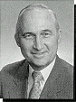
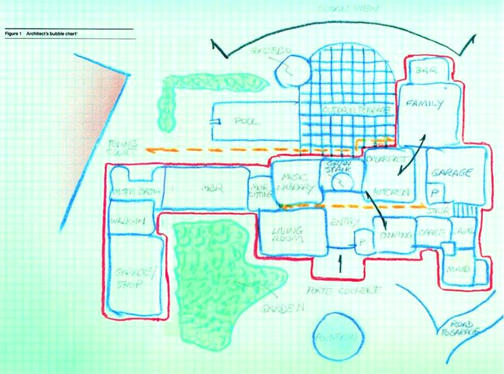
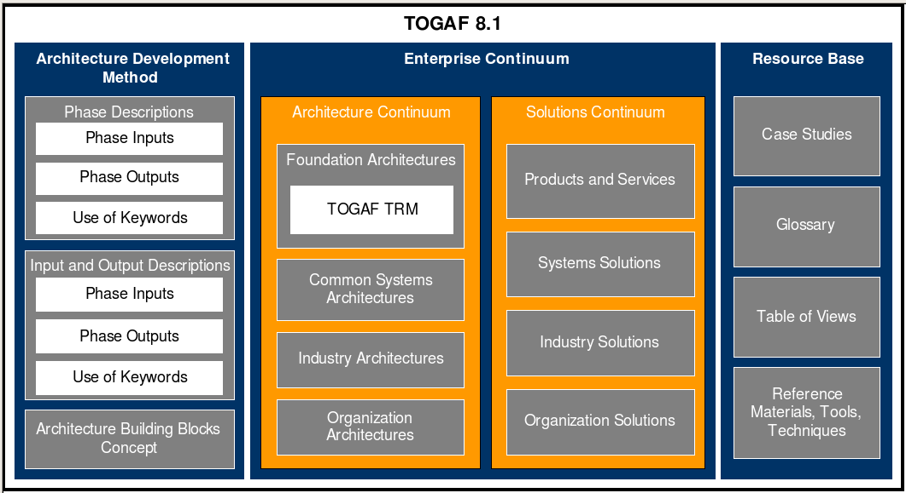

# 附录一：多种企业架构理论
不同的企业架构理论的内容不尽相同。第一个企业架构的框架理论是由约翰.在克曼（John Zachman）在1987年创立的。至今这个架构还是被企业和政府最为接受的理论，国际上通称为 Zachman Framework。随后的年代里又出现了其它几个框架理论，分别有各自的特点和侧重。本节将介绍几个主要的框架理论，具体的企业架构的内容会在企业总体架构的章节中介绍。
Zachman 企业架构框架
尽管创建的时间已经有30多年了，随后产生了很多新的技术和理念，但是Zachman框架在北美和欧洲还是被认为最为基础的理论（特别是在企业领域）。 Zachman的论文“信息系统架构框架”（Framework for Information System Architecture）直到今天在业界普遍认为是一个权威的理论，是其它框架的源泉。Zachman的名声不仅仅是由于他在框架理论上的工作，还由于他早期对于IT系统规划方面的贡献。系统规划在70年代是IBM广泛使用的信息规划的方法论。作为一个系统和有效的理论，系统计划给IBM的核心主要领导、规划部门、技术部门提供了一个强大的工具。从70年代以来，Zachman先生一直致力于信息系统规划和企业架构的推广工作。他撰写了很多有关的书籍和文章，还为全球的企业和政府提供教育和咨询，带动了企业架构的发展。

在1987年Zachman先生发表的关于企业架构的论文中，有这样一张示意图：

图表 01：Zachman论文中的房屋架构图
这张图是Zachman先生的一个建筑架构师朋友所画的设计图，是建筑师与他的客户讨论一个新建房屋的设计图。不同颜色和形式的线条代表了新房子需要有的功能，将会指导建筑队、电工、管道工等相关人员的施工；也保证了客户的需要得到了表达和满足。正如房屋架构图一样，企业建设也需要企业架构图。在Zachman的论文中，他提出了以下的五个层次的企业的框架：规划者、业务属主、系统设计者、技术设计者、开发人员。Zachman没有提出它们之间的依赖关系和如何实施这个框架，而且也主要是从IT架构的角度提出的，并没有全面的涵盖业务架构的内容。

图表 02：Zachman 框架组成的层次和元素
在上表中Zachman框架有5行6列，30 个元素组成。这个框架以最简单的形式描述了企业架构内的元素和它们的层次，和这些元素在设计中的作用。Zachman框架认为一个系统的建设需要6个方面的信息，称为6W。它们是数据（what）、功能（how）、网络（where）、人员（who）、时间（when）、动机（why）。从第一层到第五层，信息和规则会越来越多，设计会越来越细化。通过6W的划分，也使复杂、庞大的系统设计工作简单化。在设计30个元素内容的时候，它们相互不能重复，而且组合在一起就能够清晰的定义一个IT系统。
Zachman各个层次之间是有层次的，从高层次的战略和方向性的设计，逐步细化到详细设计：
——业务范围（Scope）：系统所支持的业务范围，规划系统在功能和成本等方面的整体性的要求；
——业务模型（Business Model）：描述业务实体和它们之间的关系，以及业务流程；
——系统模型（System Model）：系统设计者决定系统提供的功能和数据模型；
——技术模型（Technical Model）：考虑系统开发的工具、技术方案和平台等；
——具体定义（Detailed Decription）：定义具体的数据库、系统模块、业务规则等，能够分配给开发者开展工作。
由以上五个方面定义架构和需求就可以建立在业务运营中实际运转的系统（Working System）。所以Zachman架构主要还是解决系统建设的问题，而不涉及业务和流程的设计。
TOGAF框架
The Open Group Architecture Framework (TOGAF) 是提供了一整套方法和工具的企业架构框架。由于它是一个跨行业的、开放和免费的架构，所以在全世界得到了很广泛的使用。从1993年开始，经过了15年的发展，TOGAF已经成为了一个行业的标准。2006年的一个TechEd大会上统计，TOGAF的用户占了33%，已经超出Zachman（20%左右的用户）。下图描述了TOGAF的发展历程：

图表 03：TOGAF发展历程
TOGAF 是由The Open Group（开放团体）发起和设计的，它有300多个会员公司，包括许多世界著名的企业，比如IBM，Capgemini, Fujitsu, Hitachi, HP, NEC, 美国国防部, NASA等，其中50% 来自是北美，25% 来自欧洲， 25% 来自亚洲。目前主要使用的是TOGAF 8.1.1的版本，它有4个部分的内容：
——业务架构：定义了业务战略、治理结构、组织架构和关键的业务流程
——数据架构：描述了企业的逻辑和物理数据的组成和管理
——应用架构：描述企业各个系统的蓝图，系统之间的集成，它们与核心业务流程的关系等
——技术架构：描述了支持应用系统运行的软硬件的基础平台，包括中间件等
TOGAF 8.1.1的框架的组成部分有3大部分：
1．Architecture Development Method（ADM）：企业架构设计的方法，介绍如何根据企业具体的情况，设计具有企业特色的架构，为架构师提供设计工具和指导以及案例示范。
2．Enterprise Continuum：（EC）是一个关于架构的参考知识库，包括了行业常用的参考架构、模型、定义等，企业能够在架构项目中使用这些资源。在AMD中的不同架构设计阶段，会有提示有哪些EC中的资源能够利用。EC提供了多种参考架构，比如：TOGAF 基础架构（Foundation Architecture），提供了建立企业架构的技术参考架构TRM和标准信息平台SIB等。TRM和SIB只作为建议，而不是必须采用的标准。
3．The TOGAF Resource Base：是一系列帮助使用ADM的指导、模版、介绍信息等的信息。

图表 04：TOGAF的组成图
ADM的流程和步骤是TOGAF最有价值的一个部分，它描述了如何从无到有设计一个企业架构。也有的企业把Zachman的架构和ADM一起使用，利用ADM完整的工作步骤，设计出符合Zachman框架的企业架构。Enterprise Continuum是把企业的架构看作是一个连续体，从高层次的、普遍适用的架构，到不断个性化、特性化的架构。上文提到的TOGAF 基础架构，就是一个所有企业的IT都适用的架构，是一个最为通用的参考架构。在Enterprise Continuum中还有其它的架构，比如Common Systems Architectures，是特定类型企业适用的架构；Industry Architectures 是某个行业适用的架构；Organization Architectures是一个特定企业的架构。可以看出它们是一个越来越个性化的演变过程。
IAF框架（Integrated Architecture Framework）
IAF框架从业务和IT两个方面设计企业的架构，也是之所以称之为集成架构框架。通过分析业务和IT的战略和现存问题，设计统一的和集成的企业架构和改造线路图，通过业务和IT的改造，最终实现IT对业务的有效的支持。

图表 05：IAF企业架构方法论
IAF框架将整个企业分解成一系列相关的组成部分，其中四个涉及架构：业务、信息、IT系统和基础技术。还有两个通用的组成部分管理和安全。对这些组成部分的设计被分为四个层次：环境层次（Why）、概念层次（What）、逻辑层次（How）和物理层次（With What）。环境层次显示的是企业所处的环境，它和Zachman框架的规划者视图相似。概念层次描述了要求是什么和解决问题的方法是什么。逻辑层次描述的是针对提出的要求使用什么解决方法；物理层次描述解决方法的具体实现，定义规范、标准、指引等实施时需要遵循的架构层面的设计。IAF的层次划分的理念和Zachman和TOGFA相同，只是个层次的内容不同而已。软件、网络、存储等的架构不属于IAF的框架范围，而是在系统建设的中考虑。

图表 06：集成企业架构IAF
NASCIO企业业务架构
对于业务架构的定义在业界也有不同的方式，比如美国首席信息官协会（NASCIO）的对EBA也有定义。NASCIO主要是由美国政府部门的CIO组成，它的研究成果在美国政府中有很大的影响。它的EA的思路也是从战略出发，设计业务架构和IT架构以及实施方案。与本书不同的是它的EBA的组成部分是：信息（what）、功能（how）、地点（where）、人员（who）、业务周期（when）、业务动力（why）。这个框架借鉴了Zachman理论，从另一个角度来定义企业业务架构，可以作为我们的参考。也可以看出美国政府机构在企业架构开展了广泛的研究，取得了很多的成果。NASCIO的EBA框架图见下：

图表 07：NASCIO的业务架构以及其与其它架构的关系图